# 
 车牌定位系统(二)Sobel算子定位 

此项目只是将车牌定位出来，不做后面的车牌符号识别部分！  
此项目参考了[EasyPR](http://www.cnblogs.com/subconscious/p/4047960.html "EasyPR")开源项目，非常感谢EasyPR开发团队无偿奉献和高质量的博客。  

Sobel算子定位，分如下步骤： 

 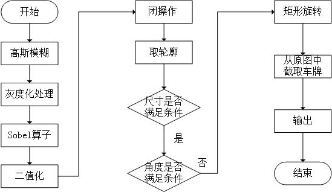 
  

图0 Sobel算子定位步骤
 

### 一、高斯模糊

**1. 目标**   

&nbsp;&nbsp;&nbsp;&nbsp;&nbsp;&nbsp;&nbsp;&nbsp;对图像去燥，同时如果车有反光，如果不用高斯模糊，反光会影响定位精度，所以高斯模糊可以消除反光对车牌定位的影响。

**2. 效果**     

&nbsp;&nbsp;&nbsp;&nbsp;&nbsp;&nbsp;&nbsp;&nbsp;在车牌定位中的第一步就是高斯模糊处理。  

 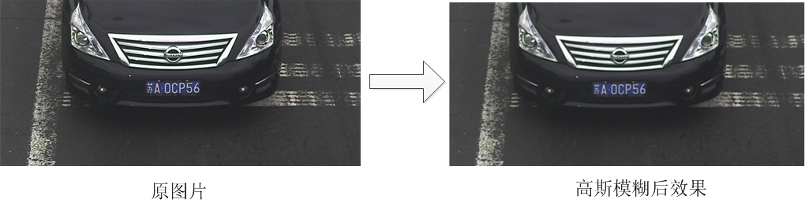 
 

图1 高斯模糊效果
 

**3. 理论**  
 
&nbsp;&nbsp;&nbsp;&nbsp;&nbsp;&nbsp;&nbsp;&nbsp;高斯模糊是非常有名的一种图像处理技术。顾名思义，其一般应用是将图像变得模糊，但同时高斯模糊也应用在图像的预处理阶段。理解高斯模糊前，先看一下平均模糊算法。平均模糊的算法非常简单。见下图，每一个像素的值都取周围所有像素（共8个）的平均值。

 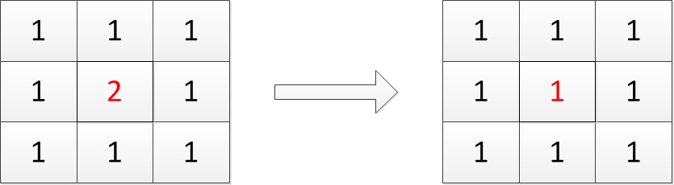 
 

图2 平均模糊示意图
   

&nbsp;&nbsp;&nbsp;&nbsp;&nbsp;&nbsp;&nbsp;&nbsp;在上图中，左边红色点的像素值本来是2，经过模糊后，就成了1（取周围所有像素的均值）。在平均模糊中，周围像素的权值都是一样的，都是1。如果周围像素的权值不一样，并且与二维的高斯分布的值一样，那么就叫做高斯模糊。

&nbsp;&nbsp;&nbsp;&nbsp;&nbsp;&nbsp;&nbsp;&nbsp;在上面的模糊过程中，每个像素取的是周围一圈的平均值，也称为模糊半径为1。如果取周围三圈，则称之为半径为3。半径增大的话，会更加深模糊的效果。 

**4. 实践**  

    //高斯模糊。Size中的数字影响车牌定位的效果。
    GaussianBlur( src, src_blur, Size(5, 5), 0, 0, BORDER_DEFAULT );  

&nbsp;&nbsp;&nbsp;&nbsp;&nbsp;&nbsp;&nbsp;&nbsp;src表示输入的图，src_blur表示输出的图，其中Size字段的参数指定了高斯模糊的半径。由于opencv的高斯模糊仅接收奇数的半径，因此变量为偶数值会抛出异常。

&nbsp;&nbsp;&nbsp;&nbsp;&nbsp;&nbsp;&nbsp;&nbsp;高斯模糊中的半径也会给结果带来明显的变化。有的图片，高斯模糊半径过高了，车牌就定位不出来。有的图片，高斯模糊半径偏低了，车牌也定位不出来。因 此、高斯模糊的半径既不宜过高，也不能过低。在数次的实验以后，保留高斯模糊过程与半径值为5是最佳的实践。

### 二、灰度化处理

**1. 目标**

&nbsp;&nbsp;&nbsp;&nbsp;&nbsp;&nbsp;&nbsp;&nbsp;由于前面还是三通道彩色图，而后面进行闭操作的函数morphologyEx和Sobel算子需要单通道的灰度图，所以要转换图模型。 

**2. 效果**   

 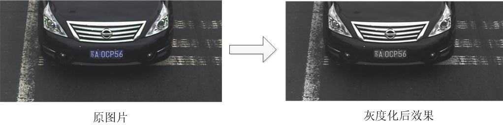 

图3 灰度化效果
 

**3. 实践**

`cvtColor(src_hsv, src_grey, CV_RGB2GRAY);` 

src\_hsv表示输入图像，src\_grey表示输出图像

### 三、Sobel算子

**1. 目标**  

&nbsp;&nbsp;&nbsp;&nbsp;&nbsp;&nbsp;&nbsp;&nbsp;检测图像中的垂直边缘，便于区分车牌。

**2. 效果**      

 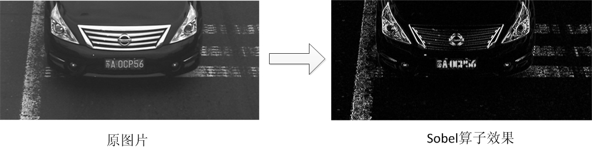 

图4 Sobel效果
 

**3. 理论**

&nbsp;&nbsp;&nbsp;&nbsp;&nbsp;&nbsp;&nbsp;&nbsp;如果要说哪个步骤是算法中的核心与灵魂，毫无疑问是Sobel算子。没有Sobel算子，也就没有垂直边缘的检测，也就无法得到车牌的可能位置，也就没有后面的一系列的车牌判断、字符识别过程。通过Sobel算子，可以很方便的得到车牌的一个相对准确的位置，为我们的后续处理打好坚实的基础。在上面的执行过程中可以看到，正是通过Sobel算子，将车牌中的字符与车的背景明显区分开来，为后面的二值化与闭操作 打下了基础。那么Sobel算子是如何运作的呢？

&nbsp;&nbsp;&nbsp;&nbsp;&nbsp;&nbsp;&nbsp;&nbsp;Soble算子原理是对图像求一阶的水平与垂直方向导数，根据导数值的大小来判断是否是边缘。请详见[博客](http://blog.csdn.net/chen134225/article/details/80908922 "博客")。

&nbsp;&nbsp;&nbsp;&nbsp;&nbsp;&nbsp;&nbsp;&nbsp;为了计算方便，Soble算子并没有真正去求导，而是使用了周边值的加权和的方法，学术上称作“卷积”。权值称为“卷积模板”。例如下图左边就是Sobel的Gx卷积模板（计算垂直边缘），中间是原图像，右边是经过卷积模板后的新图像。  

 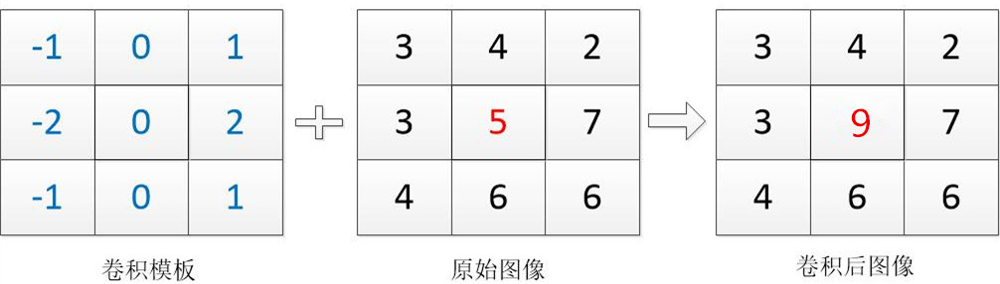 
 

图5 Sobel算子Gx示意图
   

&nbsp;&nbsp;&nbsp;&nbsp;&nbsp;&nbsp;&nbsp;&nbsp;在这里演示了通过卷积模板，原始图像红色的像素点原本是5的值，经过卷积计算（- 1 * 3 - 2 * 3 - 1 * 4 + 1 * 2 + 2 * 7 + 1 * 6 = 9）后红色像素的值变成了9。

**4. 实践**  

在代码中调用Soble算子需要较多的步骤。

    //sobel算子处理
	Mat grad_x, grad_y;
	Mat abs_grad_x, abs_grad_y;

	Sobel(mat_gray, grad_x, CV_16S, 1, 0, 3, 1, 0, BORDER_DEFAULT);
	convertScaleAbs(grad_x, abs_grad_x);

	Mat grad;
	addWeighted(abs_grad_x, 1, 0, 0, 0, grad);

&nbsp;&nbsp;&nbsp;&nbsp;&nbsp;&nbsp;&nbsp;&nbsp;在Sobel第四个和第五个参数代表水平方向和垂直方向的权值，默认前者是1，后者是0，代表仅仅做水平方向求导，而不做垂直方向求导。这样做的意义是，如果我们做了垂直方向求导，会检测出很多水平边缘。水平边缘多也许有利于生成更精确的轮廓，但是由于有些车子前端太多的水平边缘了，例如车头排气孔，标志等等，很多的水平边缘会误导我们的连接结果，导致我们得不到一个恰好的车牌位置。  

&nbsp;&nbsp;&nbsp;&nbsp;&nbsp;&nbsp;&nbsp;&nbsp;由于Sobel算子如此重要，可以将车牌与其他区域明显区分出来，那么问题就来了，有没有与Sobel功能类似的算子可以达到一致的效果，或者有没有比Sobel效果更好的算子？

&nbsp;&nbsp;&nbsp;&nbsp;&nbsp;&nbsp;&nbsp;&nbsp;Sobel算子求图像的一阶导数，Laplace算子则是求图像的二阶导数，在通常情况下，也能检测出边缘，不过Laplace算子的检测不分水平和垂直。下图是Laplace算子与Sobel算子的一个对比。 

 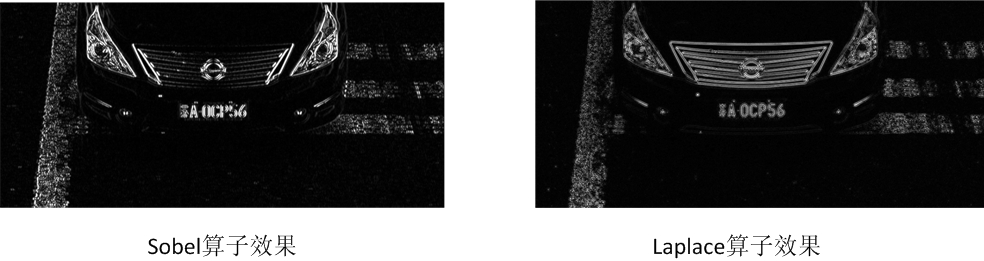 

图6 Sobel与Laplace示意图
   

&nbsp;&nbsp;&nbsp;&nbsp;&nbsp;&nbsp;&nbsp;&nbsp;可以看出，通过Laplace算子的图像包含了水平边缘和垂直边缘，根据我们刚才的描述。水平边缘对于车牌的检测一般无利反而有害。经过对近百幅图像的测试，Sobel算子的效果优于Laplace算子，因此不适宜采用Laplace算子替代Sobel算子。

&nbsp;&nbsp;&nbsp;&nbsp;&nbsp;&nbsp;&nbsp;&nbsp;除了Sobel算子，还有一个算子，Shcarr算子。但这个算子其实只是Sobel算子的一个变种，由于Sobel算子在3\*3的卷积模板上计算往往不太精确，因此有一个特殊的Sobel算子，其权值按照下图来表达，称之为Scharr算子。下图是Sobel算子与Scharr算子的一个对比。  

 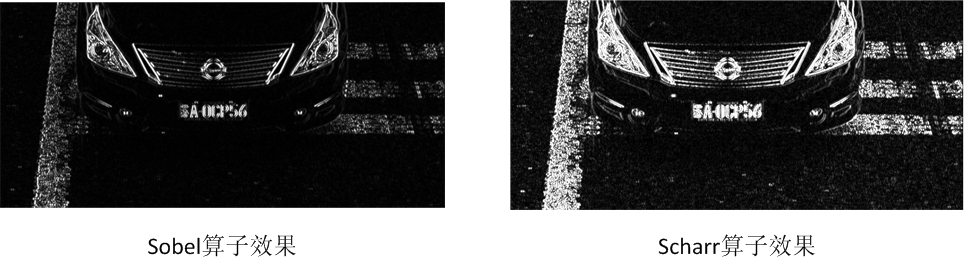 

图7 Sobel与Scharr示意图
   

&nbsp;&nbsp;&nbsp;&nbsp;&nbsp;&nbsp;&nbsp;&nbsp;一般来说，Scharr算子能够比Sobel算子检测边缘的效果更好，从上图也可以看出。但是，这个“更好”是一把双刃剑。我们的目的并不是画出图像的边缘，而是确定车牌的一个区域，越精细的边缘越会干扰后面的闭运算。因此，针对大量的图片的测试，Sobel算子一般都优于Scharr算子。

&nbsp;&nbsp;&nbsp;&nbsp;&nbsp;&nbsp;&nbsp;&nbsp;关于Sobel算子更详细的解释和Scharr算子与Sobel算子的同异，可以参看官网的介绍：Sobel与Scharr。

&nbsp;&nbsp;&nbsp;&nbsp;&nbsp;&nbsp;&nbsp;&nbsp;综上所述，在求图像边缘的过程中，Sobel算子是一个最佳的契合车牌定位需求的算子，Laplace算子与Scharr算子的效果都不如它。

&nbsp;&nbsp;&nbsp;&nbsp;&nbsp;&nbsp;&nbsp;&nbsp;有一点要说明的：Sobel算子仅能对灰度图像有效果，不能将色彩图像作为输入。因此在进行Soble算子前必须进行前面的灰度化工作。

### 四、二值化 

 **1. 目标**

&nbsp;&nbsp;&nbsp;&nbsp;&nbsp;&nbsp;&nbsp;&nbsp;为后续的形态学算子Morph等准备二值化的图像。 

**2. 效果** 

&nbsp;&nbsp;&nbsp;&nbsp;&nbsp;&nbsp;&nbsp;&nbsp;经过二值化处理后的图像效果为下图，与灰度图像仔细区分下，二值化图像中的白色是没有颜色强与暗的区别的。

 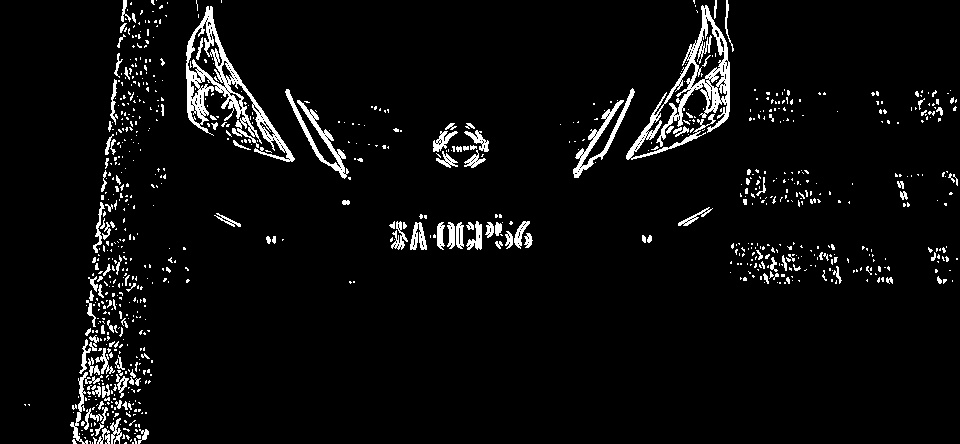 
  

图8 二值化效果
 

**3. 理论**

&nbsp;&nbsp;&nbsp;&nbsp;&nbsp;&nbsp;&nbsp;&nbsp;在灰度图像中，每个像素的值是0-255之间的数字，代表灰暗的程度。如果设定一个阈值T，规定像素的值x满足如下条件时则：

    if x < t then x = 0; if x >= t then x = 1。

&nbsp;&nbsp;&nbsp;&nbsp;&nbsp;&nbsp;&nbsp;&nbsp;如此一来，每个像素的值仅有{0,1}两种取值，0代表黑、1代表白，图像就被转换成了二值化的图像。在上面的公式中，阈值T应该取多少？由于不同图像的光造程度不同，导致作为二值化区分的阈值T也不一样。因此一个简单的做法是直接使用opencv的二值化函数时加上自适应阈值参数。如下：

    threshold(src, dest, 0, 255, CV_THRESH_OTSU+CV_THRESH_BINARY);

&nbsp;&nbsp;&nbsp;&nbsp;&nbsp;&nbsp;&nbsp;&nbsp;通过这种方法，我们不需要计算阈值的取值，直接使用即可。  
&nbsp;&nbsp;&nbsp;&nbsp;&nbsp;&nbsp;&nbsp;&nbsp;threshold函数是二值化函数，参数src代表源图像，dest代表目标图像，两者的类型都是cv::Mat型，最后的参数代表二值化时的选项，CV\_THRESH\_OTSU代表自适应阈值，CV\_THRESH\_BINARY代表正二值化。正二值化意味着像素的值越接近0，越可能被赋值为0，反之则为1。而另外一种二值化方法表示反二值化，其含义是像素的值越接近0，越可能被赋值1,，计算公式如下：

`if x < t then x = 1; if x >= t then x = 0，`　

&nbsp;&nbsp;&nbsp;&nbsp;&nbsp;&nbsp;&nbsp;&nbsp;如果想使用反二值化，可以使用参数CV\_THRESH\_BINARY\_INV代替CV\_THRESH\_BINARY即可。EasyPR项目上说：由于蓝牌字符浅，背景深，黄牌则是字符深，背景浅，因此需要正二值化方法与反二值化两种方法来处理，其中正二值化处理蓝牌，反二值化处理黄牌。但我自己试验结果表明，都用正二值化处理的结果定位率更高，使用反二值化处理黄牌，有的并不能识别处理。

 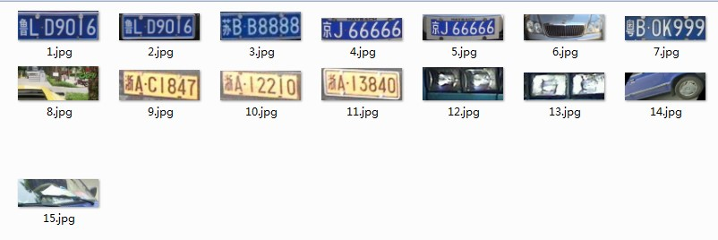 
 

图9 蓝牌用正二值化处理，黄牌用反二值化处理
 

 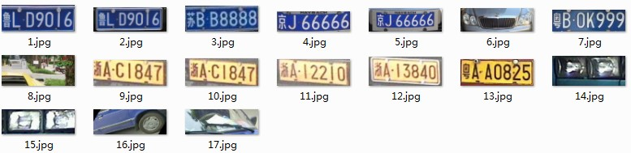 
 

图10 蓝牌和黄牌都用正二值化处理
 

&nbsp;&nbsp;&nbsp;&nbsp;&nbsp;&nbsp;&nbsp;&nbsp;从图中可以看出，黄牌使用反二值化处理，并没有识别出黄牌粤AA0825这个车牌，所以蓝牌和黄牌最好都用正二值化处理。

### 五、闭操作 

**1. 目标** 

&nbsp;&nbsp;&nbsp;&nbsp;&nbsp;&nbsp;&nbsp;&nbsp;将车牌字母连接成为一个连通域，便于取轮廓。    

**2. 效果**   

 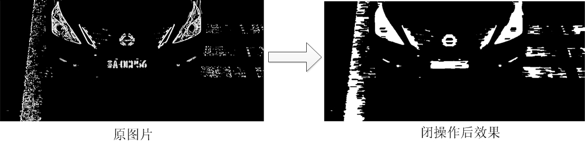 
 

图11 闭操作效果
  

**3. 理论**  

&nbsp;&nbsp;&nbsp;&nbsp;&nbsp;&nbsp;&nbsp;&nbsp;闭操作就是对图像先膨胀，再腐蚀。闭操作的结果一般是可以将许多靠近的图块相连称为一个无突起的连通域。在我们的图像定位中，使用了闭操作去连接所有的字符小图块，然后形成一个车牌的大致轮廓。闭操作的过程我会讲的细致一点。为了说明字符图块连接的过程。原图首先经过膨胀操作，将两个分开的图块结合起来（注意我用偏白的灰色图块表示由于膨胀操作而产生的新的白色）。接着通过腐蚀操作，将连通域的边缘和突起进行削平（注意我用偏黑的灰色图块表示由于腐蚀被侵蚀成黑色图块）。最后得到的是一个无突起的连通域（纯白的部分）。  

 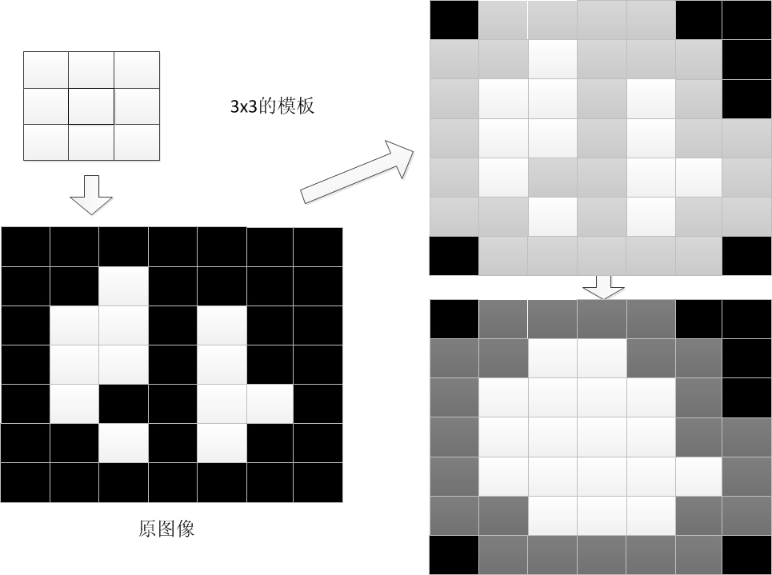 
 

图12 闭操作原理
 

**4. 代码** 

&nbsp;&nbsp;&nbsp;&nbsp;&nbsp;&nbsp;&nbsp;&nbsp;在opencv中，调用闭操作的方法是首先建立矩形模板，矩形的大小是可以设置的，由于矩形是用来覆盖以中心像素的所有其他像素，因此矩形的宽和高最好是奇数。  
&nbsp;&nbsp;&nbsp;&nbsp;通过以下代码设置矩形的宽和高。  

    Mat element = getStructuringElement(MORPH_RECT, Size(17, 3));  

&nbsp;&nbsp;&nbsp;&nbsp;&nbsp;&nbsp;&nbsp;&nbsp;opencv中所有形态学操作有一个统一的函数，通过参数来区分不同的具体操作。例如MOP_CLOSE代表闭操作，MOP_OPEN代表开操作。

    morphologyEx(src_threshold, src_threshold, MORPH_CLOSE, element);  

&nbsp;&nbsp;&nbsp;&nbsp;&nbsp;&nbsp;&nbsp;&nbsp;下图是图像使用闭操作与开操作处理后的一个区别：  

 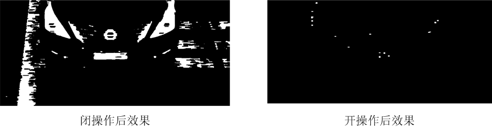 

 图13 开与闭的对比
   

&nbsp;&nbsp;&nbsp;&nbsp;&nbsp;&nbsp;&nbsp;&nbsp;怎么开操作后图像没了？原因是：开操作第一步腐蚀的效果太强，直接导致接下来的膨胀操作几乎没有效果，所以图像就变几乎没了。  
&nbsp;&nbsp;&nbsp;&nbsp;&nbsp;&nbsp;&nbsp;&nbsp;可以看出，使用闭操作以后，车牌字符的图块被连接成了一个较为规则的矩形，通过闭操作，将车牌中的字符连成了一个图块，同时将突出的部分进行裁剪，图块成为了一个类似于矩形的不规则图块。我们知道，车牌应该是一个规则的矩形，因此获取规则矩形的办法就是先取轮廓，再接着求最小外接矩形。

&nbsp;&nbsp;&nbsp;&nbsp;&nbsp;&nbsp;&nbsp;&nbsp;这里需要注意的是，矩形模板的宽度，17是个推荐值，低于17都不推荐。  
&nbsp;&nbsp;&nbsp;&nbsp;&nbsp;&nbsp;&nbsp;&nbsp;为什么这么说，因为有一个”断节“的问题。中国车牌有一个特点，就是表示城市的字母与右边相邻的字符距离远大于其他相邻字符之间的距离。如果你设置的不够大，结果导致左边的字符与右边的字符中间断开了，如下图：

 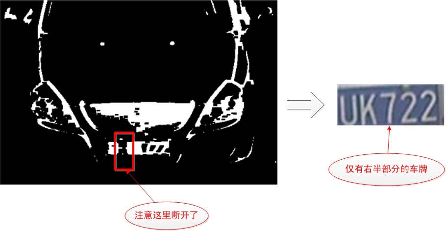 
  

图14 “断节”效果
    

&nbsp;&nbsp;&nbsp;&nbsp;&nbsp;&nbsp;&nbsp;&nbsp;这种情况我称之为“断节”如果你不想字符从中间被分成"苏A"和"7EUK22"的话，那么就必须把它设置大点。

&nbsp;&nbsp;&nbsp;&nbsp;&nbsp;&nbsp;&nbsp;&nbsp;宽度过大也是不好的，因为它会导致闭操作连接不该连接的部分，例如下图的情况。  

 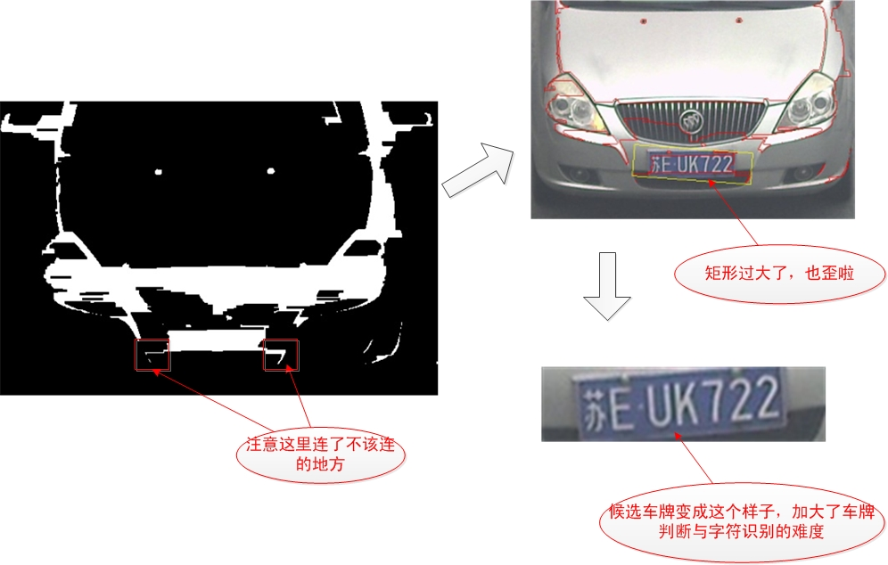 

图15 矩形模板宽度过大
   

&nbsp;&nbsp;&nbsp;&nbsp;&nbsp;&nbsp;&nbsp;&nbsp;这种情况下，你取轮廓获得矩形肯定会大于你设置的校验规则，即便通过校验了，由于图块中有不少不是车牌的部分，会给字符识别带来麻烦。

&nbsp;&nbsp;&nbsp;&nbsp;&nbsp;&nbsp;&nbsp;&nbsp;因此，矩形的宽度是一个需要非常细心权衡的值，过大过小都不好，取决于你的环境。至于矩形的高度，3是一个较好的值，一般来说都能工作的很好，不需要改变。

### 六、取轮廓

**1. 目标**   

&nbsp;&nbsp;&nbsp;&nbsp;&nbsp;&nbsp;&nbsp;&nbsp;将连通域的外围勾画出来，便于形成外接矩形   

**2. 效果**   

 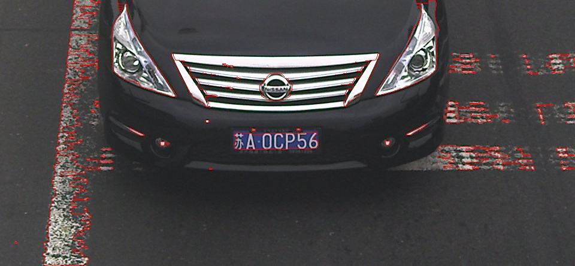 
 

图16 取轮廓操作
 

&nbsp;&nbsp;&nbsp;&nbsp;&nbsp;&nbsp;&nbsp;&nbsp;在图中，红色的线条就是轮廓，可以看到，有非常多的轮廓。取轮廓操作就是将图像中的所有独立的不与外界有交接的图块取出来。然后根据这些轮廓，求这些轮廓的最小外接矩形。这里面需要注意的是这里用的矩形是RotatedRect，意思是可旋转的。因此我们得到的矩形不是水平的，这样就为处理倾斜的车牌打下了基础。  
  
&nbsp;&nbsp;&nbsp;&nbsp;&nbsp;&nbsp;&nbsp;&nbsp;取轮廓操作的代码如下： 

    // 提取外部轮廓
	vector<vector<Point> > contours;
	findContours(src_threshold, contours, CV_RETR_EXTERNAL, CV_CHAIN_APPROX_NONE);  

### 七、尺寸判断  
 
**1. 目标**  

&nbsp;&nbsp;&nbsp;&nbsp;&nbsp;&nbsp;&nbsp;&nbsp;排除不可能是车牌的矩形。  

**2. 效果**   

&nbsp;&nbsp;&nbsp;&nbsp;&nbsp;&nbsp;&nbsp;&nbsp;经过尺寸判断，会排除大量由轮廓生成的不合适尺寸的最小外接矩形。效果如下图：  

 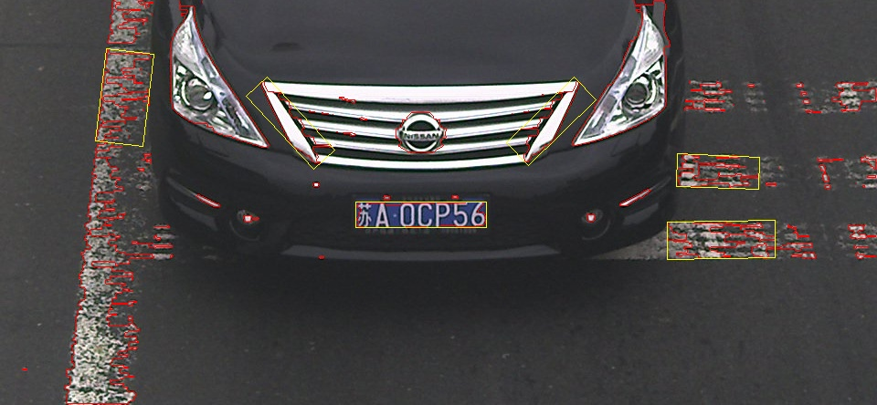 
 

图17 尺寸判断操作
 

&nbsp;&nbsp;&nbsp;&nbsp;&nbsp;&nbsp;&nbsp;&nbsp;通过对图像中所有的轮廓的外接矩形进行遍历，代码如下：  

    vector<vector<Point> >::iterator itc = contours.begin();
	while (itc != contours.end())
	{
		double area = contourArea(*itc);//获取外部轮廓包围的面积
		RotatedRect mr = minAreaRect(Mat(*itc));//获取外部轮廓的最小外接矩形
		float angle = mr.angle;
		Size rect_size = mr.size;

		/*
		根据提取的车牌面积测量，车牌面积在3000~5000范围
		*/
		if (area > 3000 && area < 50000)
		{
			/*
			由于蓝牌白字、黄牌黑字的车牌规格为440mmx140mm，
			长宽比为3.14，所以将r设置为2.2~3.8范围
			*/
			float r = (float)mr.size.width / (float)mr.size.height;
			if (r < 1)
			{
				r = (float)mr.size.height / (float)mr.size.width;
				angle = 90 + angle;
				swap(rect_size.width, rect_size.height);
			}
			if (r > 2.2 && r < 3.8 && angle - 60 < 0 && angle + 60 > 0)
			{
				//用于计算二维旋转变换矩阵
				Mat rotmat = getRotationMatrix2D(mr.center, angle, 1);
				//对图像进行仿射变换
				Mat img_rotated;
				warpAffine(src, img_rotated, rotmat, src.size(), CV_INTER_CUBIC);

				/*
				由于getRectSubPix从原图中只能提取水平放和竖着放的矩形，
				且有的车牌是斜的，所以图像要经过上面的仿射变换，将车牌旋转正，
				才能提取完整的车牌，如果不将车牌旋转正，提取不到完整的车牌
				*/
				Mat resultMat;
				getRectSubPix(img_rotated, rect_size, mr.center, resultMat);
				results.push_back(resultMat);
				
			}
		}
		++itc;
	}

&nbsp;&nbsp;&nbsp;&nbsp;&nbsp;&nbsp;&nbsp;&nbsp;中国车牌的一般大小是440mm*140mm，面积为440*140，宽高比为3.14，所以我们设置在2.2~3.8范围，如果不在这范围的，则不满足。根据提取的车牌面积测量，车牌面积在3000~50000范围内，所以不在这范围内的车牌外接矩形面积，则不满足。  

### 八、角度判断  

**1. 目标** 

&nbsp;&nbsp;&nbsp;&nbsp;&nbsp;&nbsp;&nbsp;&nbsp;排除不可能是车牌的矩形。一般来说，在一副图片中，车牌不太会有非常大的倾斜，我们做如下规定：如果一个矩形的偏斜角度大于某个角度（例如60度），则认为不是车牌并舍弃。  

### 九、旋转  

**1. 目标**  

&nbsp;&nbsp;&nbsp;&nbsp;&nbsp;&nbsp;&nbsp;&nbsp;旋转操作将偏斜的车牌调整为水平。 由于下面的函数getRectSubPix从原图中只能提取水平放和竖着放的矩形，且有的车牌是斜的，所以图像要经过仿射变换，将车牌旋转正，才能提取完整的车牌，如果不将车牌旋转正，提取不到完整的车牌。没有旋转操作的车牌是倾斜，加大了后续车牌判断与字符识别的难度。因此最好需要对车牌进行旋转。

**2. 效果**  

 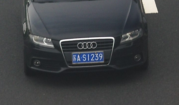 
     

图18 倾斜的车牌
  

&nbsp;&nbsp;&nbsp;&nbsp;使用旋转与不适用旋转的效果区别如下图：  

 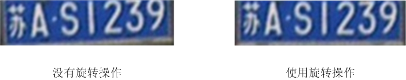 

图19 旋转的效果
   

&nbsp;&nbsp;&nbsp;&nbsp;&nbsp;&nbsp;&nbsp;&nbsp;我们使用的是整体旋转，上面的旋转效果图，只是从整体旋转图截取出来的。  

&nbsp;&nbsp;&nbsp;&nbsp;&nbsp;&nbsp;&nbsp;&nbsp;可以看出，没有旋转操作的车牌是倾斜，加大了后续车牌判断与字符识别的难度。因此最好需要对车牌进行旋转。  

    //用于计算二维旋转变换矩阵
	Mat rotmat = getRotationMatrix2D(mr.center, angle, 1);
	//对图像进行仿射变换
	Mat img_rotated;
	warpAffine(src, img_rotated, rotmat, src.size(), CV_INTER_CUBIC);

### 十、从原图中截取车牌  

    Mat resultMat;
	getRectSubPix(img_rotated, rect_size, mr.center, resultMat);

### 完整代码如下：

	//plate.h  
  	#pragma once  
  	#include <opencv2/opencv.hpp>  
  	#include <opencv2/highgui/highgui.hpp>  
  	#include <opencv2/imgproc/imgproc.hpp>

  	using namespace std;  
  	using namespace cv; 
  
  	enum Color {BLUE, YELLOW, UNKNOWN};  
	void plateSobelLocate(Mat src, vector<Mat> &results);
	void globelRotation(const Mat src, vector<Mat> &results, vector<vector<Point> > contours);

---

	//plate.cpp
	#include "plate.h"

	void globelRotation(const Mat src, vector<Mat> &results, vector<vector<Point> > contours)
	{
		vector<vector<Point> >::iterator itc = contours.begin();
		while (itc != contours.end())
		{
			double area = contourArea(*itc);//获取外部轮廓包围的面积
			RotatedRect mr = minAreaRect(Mat(*itc));//获取外部轮廓的最小外接矩形
			float angle = mr.angle;
			Size rect_size = mr.size;
	
			/*
			根据提取的车牌面积测量，车牌面积在3000~50000范围
			*/
			if (area > 3000 && area < 50000)
			{
				/*
				由于蓝牌白字、黄牌黑字的车牌规格为440mmx140mm，
				长宽比为3.14，所以将r设置为2.2~3.8范围
				*/
				float r = (float)mr.size.width / (float)mr.size.height;
				if (r < 1)
				{
					r = (float)mr.size.height / (float)mr.size.width;
					angle = 90 + angle;
					swap(rect_size.width, rect_size.height);
				}
				if (r > 2.2 && r < 3.8 && angle - 60 < 0 && angle + 60 > 0)
				{
					//用于计算二维旋转变换矩阵
					Mat rotmat = getRotationMatrix2D(mr.center, angle, 1);
					//对图像进行仿射变换
					Mat img_rotated;
					warpAffine(src, img_rotated, rotmat, src.size(), CV_INTER_CUBIC);
	
					/*
					由于getRectSubPix从原图中只能提取水平放和竖着放的矩形，
					且有的车牌是斜的，所以图像要经过上面的仿射变换，将车牌旋转正，
					才能提取完整的车牌，如果不将车牌旋转正，提取不到完整的车牌
					*/
					Mat resultMat;
					getRectSubPix(img_rotated, rect_size, mr.center, resultMat);
					results.push_back(resultMat);
	
				}
			}
			++itc;
		}
	}

	
	void plateSobelLocate(Mat src, vector<Mat> &results)
	{
		Mat src_blur;
		//高斯模糊处理
		GaussianBlur(src, src_blur, Size(5, 5), 0, 0, BORDER_DEFAULT);
	
		Mat src_gray;
		//灰度化处理
		if (src_blur.channels() == 3)
			cvtColor(src_blur, src_gray, CV_RGB2GRAY);
		else
			src_gray = src_blur;
	
		//sobel算子处理
		Mat grad_x, grad_y;
		Mat abs_grad_x, abs_grad_y;
	
		Sobel(src_gray, grad_x, CV_16S, 1, 0, 3, 1, 0, BORDER_DEFAULT);
		convertScaleAbs(grad_x, abs_grad_x);
	
		Mat grad;
		addWeighted(abs_grad_x, 1, 0, 0, 0, grad);
	
		//二值化处理
		Mat src_threshold;
		threshold(grad, src_threshold, 0, 255, CV_THRESH_OTSU + CV_THRESH_BINARY);
	
		//闭操作
		Mat element = getStructuringElement(MORPH_RECT, Size(17, 3));
		morphologyEx(src_threshold, src_threshold, MORPH_CLOSE, element);
	
		//取外部轮廓
		vector<vector<Point> > contours;
		findContours(src_threshold, contours, CV_RETR_EXTERNAL, CV_CHAIN_APPROX_NONE);
	
		//globelRotation(src, results, contours);
		partialRotation(src, src_threshold, results, contours);
	}

下面是测试代码：  

	#include "plate.h"

	int main()
	{
		char imageName[12] = "1.jpg";
		Color color = BLUE;
		Mat src = imread(imageName);
		int count = 1;
		int imageCnt = 1;
		while (!src.empty())
		{
			vector<Mat> results;
			plateColorLocate(src, results, color);
			for (int i = 0; i < (int)results.size(); ++i)
			{
				string str = "./image/";
				str = str + to_string(count) + ".jpg";
				imwrite(str, results[i]);
				++count;
			}
			++imageCnt;
			sprintf(imageName, "%d.jpg", imageCnt);		
			src = imread(imageName);
		}
		return 0;
	}
