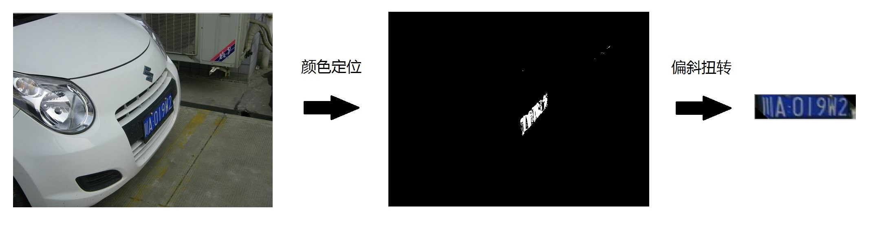

# 
 车牌定位系统(三)局部旋转 

此项目只是将车牌定位出来，不做后面的车牌符号识别部分！  
此项目参考了[EasyPR](http://www.cnblogs.com/subconscious/p/4047960.html "EasyPR")开源项目，非常感谢EasyPR开发团队无偿奉献和高质量的博客。  

### 一、偏斜扭转  

&nbsp;&nbsp;&nbsp;&nbsp;&nbsp;&nbsp;&nbsp;&nbsp;解决了车牌的定位问题以后，下面的问题是：在定位以后，我们如何把偏斜过来的车牌扭正呢？  

 

图1 偏斜扭转效果

&nbsp;&nbsp;&nbsp;&nbsp;&nbsp;&nbsp;&nbsp;&nbsp;这个过程叫做偏斜扭转过程。其中一个关键函数就是opencv的仿射变换函数。但在具体实施时，有很多需要解决的问题。 

**1. 分析**

在任何新的功能开发之前，技术预研都是第一步。

在这篇文档介绍了opencv的仿射变换功能。效果见下图   

<image src = "./image/warpAffine2.jpg">
 

图2 仿射变换效果

&nbsp;&nbsp;&nbsp;&nbsp;&nbsp;&nbsp;&nbsp;&nbsp;仔细看下，貌似这个功能跟我们的需求很相似。我们的偏斜扭转功能，说白了，就是把对图像的观察视角进行了一个转换。

&nbsp;&nbsp;&nbsp;&nbsp;&nbsp;&nbsp;&nbsp;&nbsp;不过这篇文章里的代码基本来自于另一篇官方文档。官方文档里还有一个例子，可以矩形扭转成平行四边形。而我们的需求正是将平行四边形的车牌扭正成矩形。这么说来，只要使用例子中对应的反函数，应该就可以实现我们的需求。从这个角度来看，偏斜扭转功可以实现。确定了可行性以后，下一步就是思考如何实现。

&nbsp;&nbsp;&nbsp;&nbsp;&nbsp;&nbsp;&nbsp;&nbsp;在原先的版本中，我们对定位出来的区域会进行一次角度判断，当角度小于某个阈值（默认30度）时就会进行全图旋转。  

&nbsp;&nbsp;&nbsp;&nbsp;&nbsp;&nbsp;&nbsp;&nbsp;这种方式有两个问题：

&nbsp;&nbsp;&nbsp;&nbsp;&nbsp;&nbsp;&nbsp;&nbsp;一是我们的策略是对整幅图像旋转。对于opencv来说，每次旋转操作都是一个矩形的乘法过程，对于非常大的图像，这个过程是非常消耗计算资源的；

&nbsp;&nbsp;&nbsp;&nbsp;&nbsp;&nbsp;&nbsp;&nbsp;二是30度的阈值无法处理示例图片。事实上，示例图片的定位区域的角度是-50度左右，已经大于我们的阈值了。为了处理这样的图片，我们需要把我们的阈值增大，例如增加到60度，那么这样的结果是带来候选区域的增多。

&nbsp;&nbsp;&nbsp;&nbsp;&nbsp;&nbsp;&nbsp;&nbsp;两个因素结合，会大幅度增加处理时间。为了不让处理速度下降，必须想办法规避这些影响。

&nbsp;&nbsp;&nbsp;&nbsp;&nbsp;&nbsp;&nbsp;&nbsp;一个方法是不再使用全图旋转，而是区域旋转。其实我们在获取定位区域后，我们并不需要定位区域以外的图像。

&nbsp;&nbsp;&nbsp;&nbsp;&nbsp;&nbsp;&nbsp;&nbsp;倘若我们能划出一块小的区域包围定位区域，然后我们仅对定位区域进行旋转，那么计算量就会大幅度降低。而这点，在opencv里是可以实现的，我们对定位区域RotatedRect用boundingRect()方法获取外接矩形，再使用Mat(Rect ...)方法截取这个区域图块，从而生成一个小的区域图像。于是下面的所有旋转等操作都可以基于这个区域图像进行。

&nbsp;&nbsp;&nbsp;&nbsp;&nbsp;&nbsp;&nbsp;&nbsp;在这些设计决定以后，下面就来思考整个功能的架构。

&nbsp;&nbsp;&nbsp;&nbsp;&nbsp;&nbsp;&nbsp;&nbsp;我们要解决的问题包括三类，第一类是正的车牌，第二类是倾斜的车牌，第三类是偏斜的车牌。前两类是前面说过的，第三类是本次新增的功能需求。第二类倾斜车牌与第三类车牌的区别见下图。    

<image src = "./image/warpAffine3.jpg">

图3 两类不同的旋转
  

&nbsp;&nbsp;&nbsp;&nbsp;&nbsp;&nbsp;&nbsp;&nbsp;通过上图可以看出，正视角的旋转图片的观察角度仍然是正方向的，只是由于路的不平或者摄像机的倾斜等原因，导致矩形有一定倾斜。这类图块的特点就是在RotataedRect内部，车牌部分仍然是个矩形。偏斜视角的图片的观察角度是非正方向的，是从侧面去看车牌。这类图块的特点是在RotataedRect内部，车牌部分不再是个矩形，而是一个平行四边形。这个特性决定了我们需要区别的对待这两类图片。  

&nbsp;&nbsp;&nbsp;&nbsp;&nbsp;&nbsp;&nbsp;&nbsp;通过上图可以看出，正视角的旋转图片的观察角度仍然是正方向的，只是由于路的不平或者摄像机的倾斜等原因，导致矩形有一定倾斜。这类图块的特点就是在RotataedRect内部，车牌部分仍然是个矩形。偏斜视角的图片的观察角度是非正方向的，是从侧面去看车牌。这类图块的特点是在RotataedRect内部，车牌部分不再是个矩形，而是一个平行四边形。这个特性决定了我们需要区别的对待这两类图片。

&nbsp;&nbsp;&nbsp;&nbsp;&nbsp;&nbsp;&nbsp;&nbsp;一个初步的处理思路就是下图。  

<image src = "./image/warpAffine4.jpg">
 

图4 分析实现流程
  

&nbsp;&nbsp;&nbsp;&nbsp;&nbsp;&nbsp;&nbsp;&nbsp;简单来说，整个处理流程包括下面四步：

　　1.感兴趣区域的截取   
　　2.角度判断  
　　3.偏斜判断  
　　4.仿射变换 

　　接下来按照这四个步骤依次介绍。  

**2. 截取车牌的最小正矩形图块**  

&nbsp;&nbsp;&nbsp;&nbsp;&nbsp;&nbsp;&nbsp;&nbsp;如果要使用区域旋转，首先我们必须从原图中截取出一个包含定位区域的图块。

&nbsp;&nbsp;&nbsp;&nbsp;&nbsp;&nbsp;&nbsp;&nbsp;opencv提供了一个从图像中截取感兴趣区域(Region Of Interest, ROI)的方法，也就是Mat(Rect ...)。这个方法会在Rect所在的位置，截取原图中一个图块，然后将其赋值到一个新的Mat图像里。遗憾的是这个方法不支持RotataedRect，同时Rect与RotataedRect也没有继承关系。因此布不能直接调用这个方法。

&nbsp;&nbsp;&nbsp;&nbsp;&nbsp;&nbsp;&nbsp;&nbsp;我们可以使用RotataedRect的boudingRect()方法。这个方法会返回一个RotataedRect的最小外接正矩形，而且这个矩形是一个Rect。因此将这个Rect传递给Mat(Rect...)方法就可以截取出原图的ROI图块，并获得对应的ROI图像。

&nbsp;&nbsp;&nbsp;&nbsp;&nbsp;&nbsp;&nbsp;&nbsp;需要注意的是，ROI图块和ROI图像的区别，当我们给定原图以及一个Rect时，原图中被Rect包围的区域称为ROI图块，此时图块里的坐标仍然是原图的坐标。当这个图块里的内容被拷贝到一个新的Mat里时，我们称这个新Mat为ROI图像。ROI图像里仅仅只包含原来图块里的内容，跟原图没有任何关系。所以图块和图像虽然显示的内容一样，但坐标系已经发生了改变。在从ROI图块到ROI图像以后，点的坐标要计算一个偏移量。

&nbsp;&nbsp;&nbsp;&nbsp;&nbsp;&nbsp;&nbsp;&nbsp;下一步的工作中可以仅对这个ROI图像进行处理，包括对其旋转或者变换等操作。

&nbsp;&nbsp;&nbsp;&nbsp;&nbsp;&nbsp;&nbsp;&nbsp;示例图片中的截取出来的ROI图像如下图：    

<image src = "./image/warpAffine5.jpg">
  

图5 截取后的ROI图像
   

&nbsp;&nbsp;&nbsp;&nbsp;&nbsp;&nbsp;&nbsp;&nbsp;在截取中可能会发生一个问题。如果直接使用boundingRect()函数的话，在运行过程中会经常发生这样的异常。OpenCV Error: Assertion failed (0 <= roi.x && 0 <= roi.width && roi.x + roi.width <= m.cols && 0 <= roi.y && 0 <= roi.height && roi.y + roi.height <= m.rows) incv::Mat::Mat，如下图。     

<image src = "./image/warpAffine6.jpg">
  

图6 不安全的外接矩形函数会抛出异常
   

这个异常产生的原因在于，在opencv2.4.8中（不清楚opencv其他版本是否没有这个问题），boundingRect()函数计算出的Rect的四个点的坐标没有做验证。这意味着你计算一个RotataedRect的最小正外接矩形Rect时，它可能会给你一个负坐标，或者是一个超过原图片外界的坐标。于是当你把Rect作为参数传递给Mat(Rect ...)的话，它会提示你所要截取的Rect中的坐标越界了！

&nbsp;&nbsp;&nbsp;&nbsp;&nbsp;&nbsp;&nbsp;&nbsp;解决方案是实现一个安全的计算最小正外接矩形Rect的函数，在boundingRect()结果之上，对角点坐标进行一次判断，如果值为负数，就置为0，如果值超过了原始Mat的rows或cols，就置为原始Mat的这些rows或cols。

&nbsp;&nbsp;&nbsp;&nbsp;&nbsp;&nbsp;&nbsp;&nbsp;这个安全函数名为calcSafeRect(...)，下面是这个函数的代码。  

    //! 计算一个安全的Rect
	//! 如果不存在，返回false
	bool CPlateLocate::calcSafeRect(const RotatedRect& roi_rect, const Mat& src, Rect_<float>& safeBoundRect)
	{
	    Rect_<float> boudRect = roi_rect.boundingRect();//获取roi_rect的正矩形
	
	    // boudRect的左上的x和y有可能小于0
	    float tl_x = boudRect.x > 0 ? boudRect.x : 0;
	    float tl_y = boudRect.y > 0 ? boudRect.y : 0;
	    // boudRect的右下的x和y有可能大于src的范围
	    float br_x = boudRect.x + boudRect.width < src.cols ?
	        boudRect.x + boudRect.width - 1 : src.cols - 1;
	    float br_y = boudRect.y + boudRect.height < src.rows ?
	        boudRect.y + boudRect.height - 1 : src.rows - 1;
	
	    float roi_width = br_x - tl_x;
	    float roi_height = br_y - tl_y;
	
	    if (roi_width <= 0 || roi_height <= 0)
	        return false;
	
	    // 新建一个mat，确保地址不越界，以防mat定位roi时抛异常
	    safeBoundRect = Rect_<float>(tl_x, tl_y, roi_width, roi_height);
	
	    return true;
	}

**3. 扩大化旋转**  

&nbsp;&nbsp;&nbsp;&nbsp;&nbsp;&nbsp;&nbsp;&nbsp;当我通过calcSafeRect(...)获取了一个安全的Rect，然后通过Mat(Rect ...)函数截取了这个感兴趣图像ROI以后。下面的工作就是对这个新的ROI图像进行操作。

&nbsp;&nbsp;&nbsp;&nbsp;&nbsp;&nbsp;&nbsp;&nbsp;首先是判断这个ROI图像是否要旋转。为了降低工作量，我们不对角度在-5度到5度区间的ROI进行旋转（注意这里讲的角度针对的生成ROI的RotataedRect，ROI本身是水平的）。因为这么小的角度对于SVM判断以及字符识别来说，都是没有影响的。

&nbsp;&nbsp;&nbsp;&nbsp;&nbsp;&nbsp;&nbsp;&nbsp;对其他的角度我们需要对ROI进行旋转。当我们对ROI进行旋转以后，接着把转正后的RotataedRect部分从ROI中截取出来。

&nbsp;&nbsp;&nbsp;&nbsp;&nbsp;&nbsp;&nbsp;&nbsp;但很快我们就会碰到一个新问题。让我们看一下下图，为什么我们截取出来的车牌区域最左边的“川”字和右边的“2”字发生了形变？为了搞清这个原因，作者仔细地研究了旋转与截取函数，但很快发现了形变的根源在于旋转后的ROI图像。

&nbsp;&nbsp;&nbsp;&nbsp;&nbsp;&nbsp;&nbsp;&nbsp;仔细看一下旋转后的ROI图像，是否左右两侧不再完整，像是被截去了一部分？  

<image src = "./image/warpAffine7.jpg">
 

图7 旋转后图像被截断
    

&nbsp;&nbsp;&nbsp;&nbsp;&nbsp;&nbsp;&nbsp;&nbsp;要想理解这个问题，需要理解opencv的旋转变换函数的特性。作为旋转变换的核心函数，affinTransform会要求你输出一个旋转矩阵给它。这很简单，因为我们只需要给它一个旋转中心点以及角度，它就能计算出我们想要的旋转矩阵。旋转矩阵的获得是通过如下的函数得到的：  

    Mat rot_mat = getRotationMatrix2D(new_center, angle, 1);  

&nbsp;&nbsp;&nbsp;&nbsp;&nbsp;&nbsp;&nbsp;&nbsp;在获取了旋转矩阵rot_mat，那么接下来就需要调用函数warpAffine来开始旋转操作。这个函数的参数包括一个目标图像、以及目标图像的Size。目标图像容易理解，大部分opencv的函数都会需要这个参数。我们只要新建一个Mat即可。那么目标图像的Size是什么？在一般的观点中，假设我们需要旋转一个图像，我们给opencv一个原始图像，以及我需要在某个旋转点对它旋转一个角度的需求，那么opencv返回一个图像给我即可，这个图像的Size或者说大小应该是opencv返回给我的，为什么要我来告诉它呢？

&nbsp;&nbsp;&nbsp;&nbsp;&nbsp;&nbsp;&nbsp;&nbsp;你可以试着对一个正方形进行旋转，仔细看看，这个正方形的外接矩形的大小会如何变化？当旋转角度还小时，一切都还好，当角度变大时，明显我们看到的外接矩形的大小也在扩增。在这里，外接矩形被称为视框，也就是我需要旋转的正方形所需要的最小区域。随着旋转角度的变大，视框明显增大。  

<image src = "./image/warpAffine8.jpg">
 

图8 矩形旋转后所需视框增大
  

&nbsp;&nbsp;&nbsp;&nbsp;&nbsp;&nbsp;&nbsp;&nbsp;在图像旋转完以后，有三类点会获得不同的处理，一种是有原图像对应点且在视框内的，这些点被正常显示；一类是在视框内但找不到原图像与之对应的点，这些点被置0值（显示为黑色）；最后一类是有原图像与之对应的点，但不在视框内的，这些点被悲惨的抛弃。

<image src = "./image/warpAffine9.jpg">
 

图9 旋转后三类不同点的命运
   

&nbsp;&nbsp;&nbsp;&nbsp;&nbsp;&nbsp;&nbsp;&nbsp;这就是旋转后不同三类点的命运，也就是新生成的图像中一些点呈现黑色（被置0），一些点被截断（被抛弃）的原因。如果把视框调整大点的话，就可以大幅度减少被截断点的数量。所以，为了保证旋转后的图像不被截断，因此我们需要计算一个合理的目标图像的Size，让我们的感兴趣区域得到完整的显示。

&nbsp;&nbsp;&nbsp;&nbsp;&nbsp;&nbsp;&nbsp;&nbsp;下面的代码使用了一个极为简单的策略，它将原始图像与目标图像都进行了扩大化。首先新建一个尺寸为原始图像1.5倍的新图像，接着把原始图像映射到新图像上，于是我们得到了一个显示区域(视框)扩大化后的原始图像。显示区域扩大以后，那些在原图像中没有值的像素被置了一个初值。

&nbsp;&nbsp;&nbsp;&nbsp;&nbsp;&nbsp;&nbsp;&nbsp;接着调用warpAffine函数，使用新图像的大小作为目标图像的大小。warpAffine函数会将新图像旋转，并用目标图像尺寸的视框去显示它。于是我们得到了一个所有感兴趣区域都被完整显示的旋转后图像。

&nbsp;&nbsp;&nbsp;&nbsp;&nbsp;&nbsp;&nbsp;&nbsp;这样，我们再使用getRectSubPix()函数就可以获得想要的车牌区域了。  

<image src = "./image/warpAffine10.jpg">
 

图10 扩大化旋转后图像不再被截断
   

&nbsp;&nbsp;&nbsp;&nbsp;&nbsp;&nbsp;&nbsp;&nbsp;以下就是旋转函数rotation的代码。  

	bool rotation(Mat &in, Mat &out, const Size rect_size, const Point2f center, const double angle)
	{
		Mat in_large;
		in_large.create(in.cols * 1.5, in.rows * 1.5, in.type());
	
		int x = in_large.cols / 2 - center.x > 0 ? in_large.cols / 2 - center.x : 0;//使左右两边留的一样
		int y = in_large.rows / 2 - center.y > 0 ? in_large.rows / 2 - center.y : 0;//是上下两边留的一样
	
		int width = x + in.cols < in_large.cols ? in.cols : in_large.cols - x;//如果大于，说明in_larger尺寸过小，没法融合
		int height = y + in.rows < in_large.rows ? in.rows : in_large.rows - y;
	
		//由于addWeighted函数，要求融合的尺寸必须相等，如果不相等，融合发生错误，所以要判断一下
		if (width != in.cols || height != in.rows)
			return false;
	
		//融合图形，新图形还保存在in_large
		Mat imageRoi = in_large(Rect(x, y, width, height));
		addWeighted(imageRoi, 0, in, 1, 0, imageRoi);
	
		Point2f center_diff(in.cols / 2, in.rows / 2);
		Point2f new_center(in_large.cols / 2, in_large.rows / 2);
	
		Mat rot_mat = getRotationMatrix2D(new_center, angle, 1);//得到旋转矩阵
	
		//将图形进行旋转
		Mat mat_rotated;
		warpAffine(in_large, mat_rotated, rot_mat, Size(in_large.cols, in_large.rows), CV_INTER_CUBIC);
	
		//得到最小外接图像
		Mat img_crop;
		getRectSubPix(mat_rotated, Size(rect_size.width, rect_size.height), new_center, img_crop);
	
		out = img_crop;
	
		return true;
	}  

**4. 偏斜判断** 

&nbsp;&nbsp;&nbsp;&nbsp;&nbsp;&nbsp;&nbsp;&nbsp;当我们对ROI进行旋转以后，下面一步工作就是把RotataedRect部分从ROI中截取出来，这里可以使用getRectSubPix方法，这个函数可以在被旋转后的图像中截取一个正的矩形图块出来，并赋值到一个新的Mat中，称为车牌区域。

&nbsp;&nbsp;&nbsp;&nbsp;&nbsp;&nbsp;&nbsp;&nbsp;下步工作就是分析截取后的车牌区域。车牌区域里的车牌分为正角度和偏斜角度两种。对于正的角度而言，可以看出车牌区域就是车牌，因此直接输出即可。而对于偏斜角度而言，车牌是平行四边形，与矩形的车牌区域不重合。

&nbsp;&nbsp;&nbsp;&nbsp;&nbsp;&nbsp;&nbsp;&nbsp;如何判断一个图像中的图形是否是平行四边形？

&nbsp;&nbsp;&nbsp;&nbsp;&nbsp;&nbsp;&nbsp;&nbsp;一种简单的思路就是对图像二值化，然后根据二值化图像进行判断。图像二值化的方法有很多种，假设我们这里使用一开始在车牌定位功能中使用的大津阈值二值化法的话，效果不会太好。因为大津阈值是自适应阈值，在完整的图像中二值出来的平行四边形可能在小的局部图像中就不再是。最好的办法是使用在前面定位模块生成后的原图的二值图像，我们通过同样的操作就可以在原图中截取一个跟车牌区域对应的二值化图像。

&nbsp;&nbsp;&nbsp;&nbsp;&nbsp;&nbsp;&nbsp;&nbsp;下图就是一个二值化车牌区域获得的过程。

<image src = "./image/warpAffine11.jpg">
 

图11 二值化的车牌区域
   

&nbsp;&nbsp;&nbsp;&nbsp;&nbsp;&nbsp;&nbsp;&nbsp;接下来就是对二值化车牌区域进行处理。为了判断二值化图像中白色的部分是平行四边形。一种简单的做法就是从图像中选择一些特定的行。计算在这个行中，第一个全为0的串的长度。从几何意义上来看，这就是平行四边形斜边上某个点距离外接矩形的长度。

&nbsp;&nbsp;&nbsp;&nbsp;&nbsp;&nbsp;&nbsp;&nbsp;假设我们选择的这些行位于二值化图像高度的1/4，2/4，3/4处的话，如果是白色图形是矩形的话，这些串的大小应该是相等或者相差很小的，相反如果是平行四边形的话，那么这些串的大小应该不等，并且呈现一个递增或递减的关系。通过这种不同，我们就可以判断车牌区域里的图形，究竟是矩形还是平行四边形。

&nbsp;&nbsp;&nbsp;&nbsp;&nbsp;&nbsp;&nbsp;&nbsp;偏斜判断的另一个重要作用就是，计算平行四边形倾斜的斜率，这个斜率值用来在下面的仿射变换中发挥作用。我们使用一个简单的公式去计算这个斜率，那就是利用上面判断过程中使用的串大小，假设二值化图像高度的1/4，2/4，3/4处对应的串的大小分别为len1，len2，len3，车牌区域的高度为Height。一个计算斜率slope的计算公式就是：(len3\-len1)/Height\*2。

&nbsp;&nbsp;&nbsp;&nbsp;&nbsp;&nbsp;&nbsp;&nbsp;Slope的直观含义见下图。  

<image src = "./image/warpAffine12.jpg">

图12 slope的几何含义
 

&nbsp;&nbsp;&nbsp;&nbsp;&nbsp;&nbsp;&nbsp;&nbsp;需要说明的，这个计算结果在平行四边形是右斜时是负值，而在左斜时则是正值。于是可以根据slope的正负判断平行四边形是右斜或者左斜。在实践中，会发生一些公式不能应对的情况，例如像下图这种情况，斜边的部分区域发生了内凹或者外凸现象。这种现象会导致len1,len2或者len3的计算有误，因此slope也会不准。  

<image src = "./image/warpAffine13.jpg">
 

图13 内凹现象
 

&nbsp;&nbsp;&nbsp;&nbsp;&nbsp;&nbsp;&nbsp;&nbsp;为了实现一个鲁棒性更好的计算方法，可以用(len2\-len1)/Height*4与(len3-len1)/Height\*2两者之间更靠近tan(angle)的值作为solpe的值（在这里，angle代表的是原来RotataedRect的角度）。

&nbsp;&nbsp;&nbsp;&nbsp;&nbsp;&nbsp;&nbsp;&nbsp;多采取了一个slope备选的好处是可以避免单点的内凹或者外凸，但这仍然不是最好的解决方案。在最后的讨论中会介绍一个其他的实现思路。

&nbsp;&nbsp;&nbsp;&nbsp;&nbsp;&nbsp;&nbsp;&nbsp;完成偏斜判断与斜率计算的函数是isdeflection，下面是它的代码。

	//! 是否偏斜
	//! 输入二值化图像，输出判断结果
	bool isdeflection(const Mat& in, const double angle, double& slope)
	{
		int nRows = in.rows;
		int nCols = in.cols;
	
		assert(in.channels() == 1);
	
		int comp_index[3];
		int len[3];
	
		comp_index[0] = nRows / 4;
		comp_index[1] = nRows / 4 * 2;
		comp_index[2] = nRows / 4 * 3;
	
		const uchar* p = NULL;
	
		for (int i = 0; i < 3; i++)
		{
			int index = comp_index[i];
			p = in.ptr<uchar>(index);
	
			int j = 0;
			int value = 0;
			while (0 == value && j < nCols)
				value = int(p[j++]);
	
			len[i] = j;
		}
	
		double maxlen = max(len[2], len[0]);
		double minlen = min(len[2], len[0]);
		double difflen = abs(len[2] - len[0]);
	
		double PI = 3.14159265;
		double g = tan(angle * PI / 180.0);
	
		if (maxlen - len[1] > nCols / 32 || len[1] - minlen > nCols / 32) {
			// 如果斜率为正，则底部在下，反之在上
			double slope_can_1 = double(len[2] - len[0]) / double(comp_index[1]);
			double slope_can_2 = double(len[1] - len[0]) / double(comp_index[0]);
			double slope_can_3 = double(len[2] - len[1]) / double(comp_index[0]);
	
			slope = abs(slope_can_1 - g) <= abs(slope_can_2 - g) ? slope_can_1 : slope_can_2;
			
			return true;
		}
		else {
			slope = 0;
		}
	
		return false;
	}

**5. 仿射变换**  

&nbsp;&nbsp;&nbsp;&nbsp;&nbsp;&nbsp;&nbsp;&nbsp;俗话说：行百里者半九十。前面已经做了如此多的工作，应该可以实现偏斜扭转功能了吧？但在最后的道路中，仍然有问题等着我们。

&nbsp;&nbsp;&nbsp;&nbsp;&nbsp;&nbsp;&nbsp;&nbsp;我们已经实现了旋转功能，并且在旋转后的区域中截取了车牌区域，然后判断车牌区域中的图形是一个平行四边形。下面要做的工作就是把平行四边形扭正成一个矩形。
 

<image src = "./image/warpAffine14.jpg">
 

图14 从平行四边形车牌到矩形车牌
  

&nbsp;&nbsp;&nbsp;&nbsp;&nbsp;&nbsp;&nbsp;&nbsp;首先第一个问题就是解决如何从平行四边形变换成一个矩形的问题。opencv提供了一个函数warpAffine，就是仿射变换函数。注意，warpAffine不仅可以让图像旋转（前面介绍过），也可以进行仿射变换，真是一个多才多艺的函数。o

&nbsp;&nbsp;&nbsp;&nbsp;&nbsp;&nbsp;&nbsp;&nbsp;通过仿射变换函数可以把任意的矩形拉伸成其他的平行四边形。opencv的官方文档里给了一个示例，值得注意的是，这个示例演示的是把矩形变换为平行四边形，跟我们想要的恰恰相反。但没关系，我们先看一下它的使用方法。  

<image src = "./image/warpAffine15.jpg">
 

图15 opencv官网上对warpAffine使用的示例
  

&nbsp;&nbsp;&nbsp;&nbsp;&nbsp;&nbsp;&nbsp;&nbsp;warpAffine方法要求输入的参数是原始图像的左上点，右上点，左下点，以及输出图像的左上点，右上点，左下点。注意，必须保证这些点的对应顺序，否则仿射的效果跟你预想的不一样。通过这个方法介绍，我们可以大概看出，opencv需要的是三个点对（共六个点）的坐标，然后建立一个映射关系，通过这个映射关系将原始图像的所有点映射到目标图像上。　    

<image src = "./image/warpAffine16.jpg">
  

图16 warpAffine需要的三个对应坐标点
   

&nbsp;&nbsp;&nbsp;&nbsp;&nbsp;&nbsp;&nbsp;&nbsp;再回来看一下我们的需求，我们的目标是把车牌区域中的平行四边形映射为一个矩形。让我们做个假设，如果我们选取了车牌区域中的平行四边形车牌的三个关键点，然后再确定了我们希望将车牌扭正成的矩形的三个关键点的话，我们是否就可以实现从平行四边形车牌到矩形车牌的扭正？

&nbsp;&nbsp;&nbsp;&nbsp;&nbsp;&nbsp;&nbsp;&nbsp;让我们画一幅图像来看看这个变换的作用。有趣的是，把一个平行四边形变换为矩形会对包围平行四边形车牌的区域带来影响。

&nbsp;&nbsp;&nbsp;&nbsp;&nbsp;&nbsp;&nbsp;&nbsp;例如下图中，蓝色的实线代表扭转前的平行四边形车牌，虚线代表扭转后的。黑色的实线代表矩形的车牌区域，虚线代表扭转后的效果。可以看到，当蓝色车牌被扭转为矩形的同时，黑色车牌区域则被扭转为平行四边形。

&nbsp;&nbsp;&nbsp;&nbsp;&nbsp;&nbsp;&nbsp;&nbsp;注意，当车牌区域扭变为平行四边形以后，需要显示它的视框增大了。跟我们在旋转图像时碰到的情形一样。  

<image src = "./image/warpAffine17.jpg">
  

图17 平行四边形的扭转带来的变化
   

&nbsp;&nbsp;&nbsp;&nbsp;&nbsp;&nbsp;&nbsp;&nbsp;让我们先实际尝试一下仿射变换吧。

&nbsp;&nbsp;&nbsp;&nbsp;&nbsp;&nbsp;&nbsp;&nbsp;根据仿射函数的需要，我们计算平行四边形车牌的三个关键点坐标。其中左上点的值(xdiff,0)中的xdiff就是根据车牌区域的高度height与平行四边形的斜率slope计算得到的：

&nbsp;&nbsp;&nbsp;&nbsp;&nbsp;&nbsp;&nbsp;&nbsp;为了计算目标矩形的三个关键点坐标，我们首先需要把扭转后的原点坐标调整到平行四边形车牌区域左上角位置。见下图。    

<image src = "./image/warpAffine18.jpg">
  

图18 原图像的坐标计算
    

&nbsp;&nbsp;&nbsp;&nbsp;&nbsp;&nbsp;&nbsp;&nbsp;依次推算关键点的三个坐标。它们应该是  

	plTri[0] = Point2f(0 + xiff, 0);
    plTri[1] = Point2f(width - 1, 0);
    plTri[2] = Point2f(0, height - 1);

    dstTri[0] = Point2f(xiff, 0);
    dstTri[1] = Point2f(width - 1, 0);
    dstTri[2] = Point2f(xiff, height - 1);

&nbsp;&nbsp;&nbsp;&nbsp;&nbsp;&nbsp;&nbsp;&nbsp;根据上图的坐标，我们开始进行一次仿射变换的尝试。

&nbsp;&nbsp;&nbsp;&nbsp;&nbsp;&nbsp;&nbsp;&nbsp;opencv的warpAffine函数不会改变变换后图像的大小。而我们给它传递的目标图像的大小仅会决定视框的大小。不过这次我们不用担心视框的大小，因为根据图27看来，哪怕视框跟原始图像一样大，我们也足够显示扭正后的车牌。

&nbsp;&nbsp;&nbsp;&nbsp;&nbsp;&nbsp;&nbsp;&nbsp;看看仿射的效果。晕，好像效果不对，视框的大小是足够了，但是图像往右偏了一些，导致最右边的字母没有显示全。  

<image src = "./image/warpAffine19.jpg">
  

图19 被偏移的车牌区域
     

&nbsp;&nbsp;&nbsp;&nbsp;&nbsp;&nbsp;&nbsp;&nbsp;这次的问题不再是目标图像的大小问题了，而是视框的偏移问题。仔细观察一下我们的视框，倘若我们想把车牌全部显示的话，视框往右偏移一段距离，是不是就可以解决这个问题呢？为保证新的视框中心能够正好与车牌的中心重合，我们可以选择偏移xidff/2长度。正如下图所显示的一样。   

<image src = "./image/warpAffine20.jpg">
  

图20 考虑偏移的坐标计算
   

&nbsp;&nbsp;&nbsp;&nbsp;&nbsp;&nbsp;&nbsp;&nbsp;视框往右偏移的含义就是目标图像Mat的原点往右偏移。如果原点偏移的话，那么仿射后图像的三个关键点的坐标要重新计算，都需要减去xidff/2大小。

&nbsp;&nbsp;&nbsp;&nbsp;&nbsp;&nbsp;&nbsp;&nbsp;重新计算的映射点坐标为下：  

    plTri[0] = Point2f(0 + xiff, 0);
    plTri[1] = Point2f(width - 1, 0);
    plTri[2] = Point2f(0, height - 1);

    dstTri[0] = Point2f(xiff/2, 0);
    dstTri[1] = Point2f(width - 1 - xiff + xiff/2, 0);
    dstTri[2] = Point2f(xiff/2, height - 1);

&nbsp;&nbsp;&nbsp;&nbsp;&nbsp;&nbsp;&nbsp;&nbsp;再试一次。果然，视框被调整到我们希望的地方了，我们可以看到所有的车牌区域了。这次解决的是warpAffine函数带来的视框偏移问题。  

&nbsp;&nbsp;&nbsp;&nbsp;&nbsp;&nbsp;&nbsp;&nbsp;关于坐标调整的另一个理解就是当中心点保持不变时，平行四边形扭正为矩形时恰好是左上的点往左偏移了xdiff/2的距离，左下的点往右偏移了xdiff/2的距离，形成一种对称的平移。可以使用ps或者inkspace类似的矢量制图软件看看“斜切”的效果，　

&nbsp;&nbsp;&nbsp;&nbsp;&nbsp;&nbsp;&nbsp;&nbsp;如此一来，就完成了偏斜扭正的过程。需要注意的是，向左倾斜的车牌的视框偏移方向与向右倾斜的车牌是相反的。我们可以用slope的正负来判断车牌是左斜还是右斜。  

**6. 总结**  

&nbsp;&nbsp;&nbsp;&nbsp;&nbsp;&nbsp;&nbsp;&nbsp;通过以上过程，我们成功的将一个偏斜的车牌经过旋转变换等方法扭正过来。

&nbsp;&nbsp;&nbsp;&nbsp;&nbsp;&nbsp;&nbsp;&nbsp;让我们回顾一下偏斜扭正过程。我们需要将一个偏斜的车牌扭正，为了达成这个目的我们首先需要对图像进行旋转。因为旋转是个计算量很大的函数，所以我们需要考虑不再用全图旋转，而是区域旋转。在旋转过程中，会发生图像截断问题，所以需要使用扩大化旋转方法。旋转以后，只有偏斜视角的车牌才需要扭正，正视角的车牌不需要，因此还需要一个偏斜判断过程。如此一来，偏斜扭正的过程需要旋转，区域截取，扩大化，偏斜判断等等过程的协助，这就是整个流程中有这么多步需要处理的原因。

&nbsp;&nbsp;&nbsp;&nbsp;&nbsp;&nbsp;&nbsp;&nbsp;下图从另一个视角回顾了偏斜扭正的过程，主要说明了偏斜扭转中的两次“截取”过程。  

<image src = "./image/warpAffine21.jpg">
 

图21 偏斜扭正全过程
   

- 首先我们获取RotatedRect，然后对每个RotatedRect获取外界矩形，也就是ROI区域。外接矩形的计算有可能获得不安全的坐标，因此需要使用安全的获取外界矩形的函数。  

- 获取安全外接矩形以后，在原图中截取这部分区域，并放置到一个新的Mat里，称之为ROI图像。这是本过程中第一次截取，使用Mat(Rect ...)函数。

- 接下来对ROI图像根据RotatedRect的角度展开旋转，旋转的过程中使用了放大化旋转法，以此防止车牌区域被截断。

- 旋转完以后，我们把已经转正的RotatedRect部分截取出来，称之为车牌区域。这是本过程中第二次截取，与第一次不同，这次截取使用getRectSubPix()方法。

- 接下里使用偏斜判断函数来判断车牌区域里的车牌是否是倾斜的。

- 如果是，则继续使用仿射变换函数wrapAffine来进行扭正处理，处理过程中要注意三个关键点的坐标。  

### 二、完整代码   

	void partialRotation(const Mat src, Mat src_grey, vector<Mat> &results, vector<vector<Point> > contours)
	{
		vector<RotatedRect> min_area_rects;//保存最小外接斜矩形
	
		vector<vector<Point> >::iterator itc = contours.begin();
		while (itc != contours.end())
		{
	
			double area = contourArea(*itc);//获取外部轮廓包围的面积
			RotatedRect mr = minAreaRect(Mat(*itc));//获取外部轮廓的最小外接矩形
			float angle = mr.angle;
			Size rect_size = mr.size;
	
			/*
			根据提取的车牌面积测量，车牌面积在3000~50000范围
			*/
			if (area > 3000 && area < 50000)
			{
				/*
				由于蓝牌白字、黄牌黑字的车牌规格为440mmx140mm，
				长宽比为3.14，所以将r设置为2.2~3.8范围
				*/
				float r = (float)mr.size.width / (float)mr.size.height;
				if (r < 1)
				{
					r = (float)mr.size.height / (float)mr.size.width;
					angle = 90 + angle;
				}
				if (r > 2.2 && r < 3.8 && angle - 60 < 0 && angle + 60 > 0)
				{
					min_area_rects.push_back(mr);
				}
			}
			++itc;
		}
	
		for (size_t i = 0; i < min_area_rects.size(); ++i)
		{
			RotatedRect roi_rect = min_area_rects[i];
	
			float r = (float)roi_rect.size.width / (float)roi_rect.size.height;
			float roi_angle = roi_rect.angle;
	
			Size roi_rect_size = roi_rect.size;
			if (r < 1)
			{
				roi_angle = 90 + roi_angle;
				swap(roi_rect_size.width, roi_rect_size.height);
			}
			Rect_<float> safeBoundRect;//保存最小外接正矩形的坐标
			bool isFormRect = calcSafeRect(roi_rect, src, safeBoundRect);
			if (!isFormRect)
				continue;
			Mat bound_mat = src(safeBoundRect);//在原图上截取车牌的最小正矩形图像
			Mat bound_mat_grey = src_grey(safeBoundRect);//在二值化图上截取车牌的最小正矩形图形
	
			Point2f roi_ref_center = roi_rect.center - safeBoundRect.tl();
	
			Mat deskew_mat;
			if (roi_angle - 5 < 0 && roi_angle + 5 > 0)
				deskew_mat = bound_mat;
			else
			{
				Mat rotated_mat;
				Mat rotated_mat_grey;
	
				//将车牌旋转成水平，旋转后的车牌不一定是正的，也有可能是斜矩形
				if (!rotation(bound_mat, rotated_mat, roi_rect_size, roi_ref_center, roi_angle))//旋转原图车牌
					continue;
	
				if (!rotation(bound_mat_grey, rotated_mat_grey, roi_rect_size, roi_ref_center, roi_angle))//旋转二值化图车牌
					continue;
	
				double roi_slope = 0;//保存斜水平车牌的斜率
				if (isdeflection(rotated_mat_grey, roi_angle, roi_slope))
				{
					affine(rotated_mat, deskew_mat, roi_slope);
				}
				else
					deskew_mat = rotated_mat;
	
			}
	
			results.push_back(deskew_mat);
		}

 	}  

	bool calcSafeRect(const RotatedRect& roi_rect, const Mat& src, Rect_<float>& safeBoundRect)
	{
		Rect_<float> boudRect = roi_rect.boundingRect();//获取roi_rect的正矩形
		float t1_x = boudRect.x > 0 ? boudRect.x : 0;
		float t1_y = boudRect.y > 0 ? boudRect.y : 0;
	
		float br_x = boudRect.x + boudRect.width < src.cols ? boudRect.x + boudRect.width - 1 : src.cols - 1;
		float br_y = boudRect.y + boudRect.height < src.rows ? boudRect.y + boudRect.height : src.rows - 1;
	
		float roi_width = br_x - t1_x;
		float roi_height = br_y - t1_y;
	
		if (roi_width <= 0 || roi_height <= 0)
			return false;
	
		safeBoundRect = Rect_<float>(t1_x, t1_y, roi_width, roi_height);
		return true;
	}

	bool rotation(Mat &in, Mat &out, const Size rect_size, const Point2f center, const double angle)
	{
		Mat in_large;
		in_large.create(in.cols * 1.5, in.rows * 1.5, in.type());
	
		int x = in_large.cols / 2 - center.x > 0 ? in_large.cols / 2 - center.x : 0;//使左右两边留的一样
		int y = in_large.rows / 2 - center.y > 0 ? in_large.rows / 2 - center.y : 0;//是上下两边留的一样
	
		int width = x + in.cols < in_large.cols ? in.cols : in_large.cols - x;//如果大于，说明in_larger尺寸过小，没法融合
		int height = y + in.rows < in_large.rows ? in.rows : in_large.rows - y;
	
		//由于addWeighted函数，要求融合的尺寸必须相等，如果不相等，融合发生错误，所以要判断一下
		if (width != in.cols || height != in.rows)
			return false;
	
		//融合图形，新图形还保存在in_large
		Mat imageRoi = in_large(Rect(x, y, width, height));
		addWeighted(imageRoi, 0, in, 1, 0, imageRoi);
	
		Point2f center_diff(in.cols / 2, in.rows / 2);
		Point2f new_center(in_large.cols / 2, in_large.rows / 2);
	
		Mat rot_mat = getRotationMatrix2D(new_center, angle, 1);//得到旋转矩阵
	
		//将图形进行旋转
		Mat mat_rotated;
		warpAffine(in_large, mat_rotated, rot_mat, Size(in_large.cols, in_large.rows), CV_INTER_CUBIC);
	
		//得到最小外接图像
		Mat img_crop;
		getRectSubPix(mat_rotated, Size(rect_size.width, rect_size.height), new_center, img_crop);
	
		out = img_crop;
	
		return true;
	}

	//! 是否偏斜
	//! 输入二值化图像，输出判断结果
	bool isdeflection(const Mat& in, const double angle, double& slope)
	{
		int nRows = in.rows;
		int nCols = in.cols;
	
		assert(in.channels() == 1);
	
		int comp_index[3];
		int len[3];
	
		comp_index[0] = nRows / 4;
		comp_index[1] = nRows / 4 * 2;
		comp_index[2] = nRows / 4 * 3;
	
		const uchar* p = NULL;
	
		for (int i = 0; i < 3; i++)
		{
			int index = comp_index[i];
			p = in.ptr<uchar>(index);
	
			int j = 0;
			int value = 0;
			while (0 == value && j < nCols)
				value = int(p[j++]);
	
			len[i] = j;
		}
	
		double maxlen = max(len[2], len[0]);
		double minlen = min(len[2], len[0]);
		double difflen = abs(len[2] - len[0]);
	
		double PI = 3.14159265;
		double g = tan(angle * PI / 180.0);
	
		if (maxlen - len[1] > nCols / 32 || len[1] - minlen > nCols / 32) {
			// 如果斜率为正，则底部在下，反之在上
			double slope_can_1 = double(len[2] - len[0]) / double(comp_index[1]);
			double slope_can_2 = double(len[1] - len[0]) / double(comp_index[0]);
			double slope_can_3 = double(len[2] - len[1]) / double(comp_index[0]);
	
			slope = abs(slope_can_1 - g) <= abs(slope_can_2 - g) ? slope_can_1 : slope_can_2;
			
			return true;
		}
		else {
			slope = 0;
		}
	
		return false;
	}

	//将水平斜矩形车牌，旋转成正矩形
	void affine(const Mat& in, Mat& out, const double slope)
	{
		Point2f dstTri[3];
		Point2f plTri[3];
	
		float height = (float)in.rows;
		float width = (float)in.cols;
		float xiff = (float)abs(slope) * height;
	
		if (slope > 0)
		{
			plTri[0] = Point2f(0, 0);
			plTri[1] = Point2f(width - xiff - 1, 0);
			plTri[2] = Point2f(xiff, height - 1);
	
			dstTri[0] = Point2f(xiff / 2, 0);
			dstTri[1] = Point2f(width - xiff / 2 - 1, 0);
			dstTri[2] = Point2f(xiff / 2, height - 1);
		}
		else
		{
			plTri[0] = Point2f(xiff / 2, 0);
			plTri[1] = Point2f(width - 1, 0);
			plTri[2] = Point2f(0, height - 1);
	
			dstTri[0] = Point2f(xiff / 2, 0);
			dstTri[1] = Point2f(width - xiff / 2 - 1, 0);
			dstTri[2] = Point2f(xiff / 2, height - 1);
		}
	
		Mat warp_mat = getAffineTransform(plTri, dstTri);//得到仿射矩阵
		Mat affine_mat;
		warpAffine(in, affine_mat, warp_mat, in.size(), CV_INTER_CUBIC);
	
		out = affine_mat;
	}

