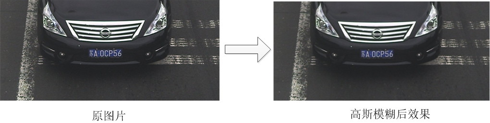
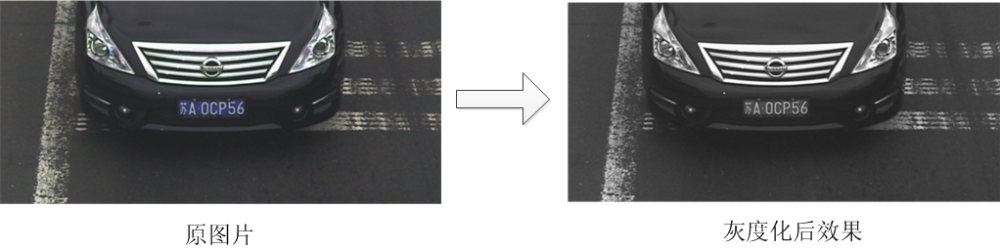
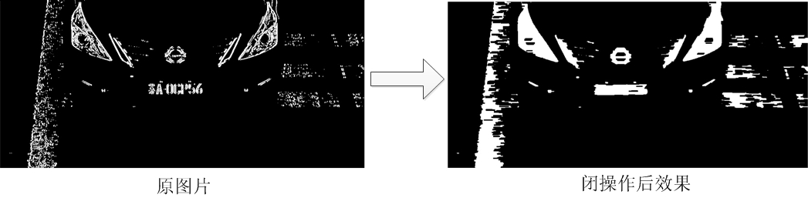
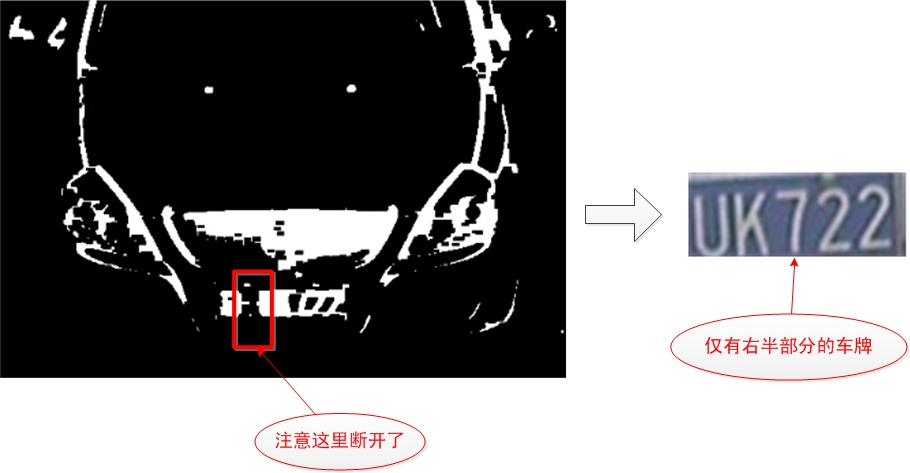
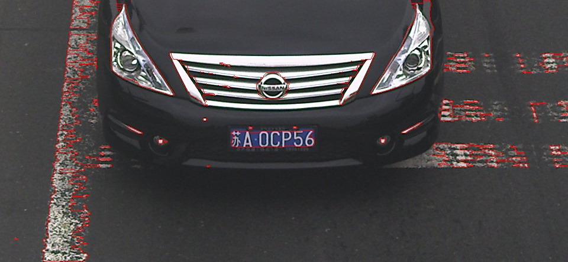
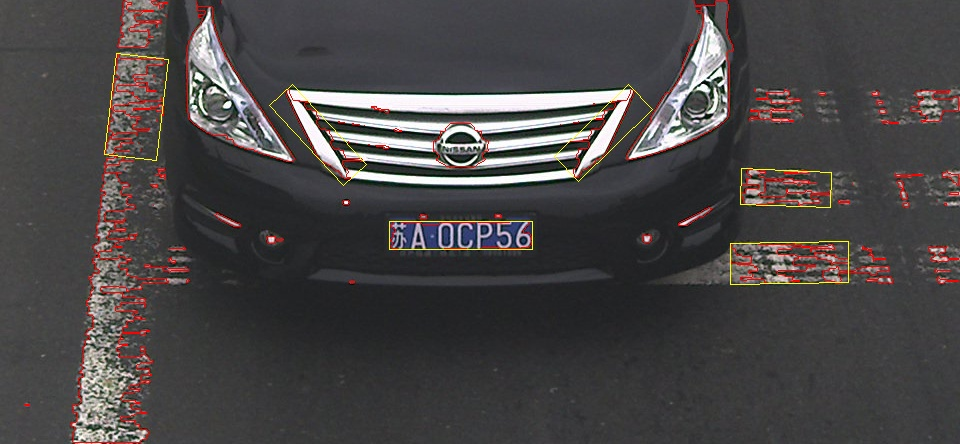
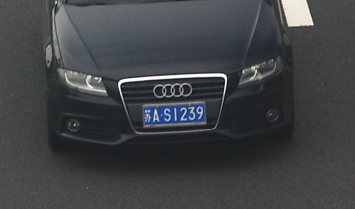

# 
 车牌定位系统(一)颜色定位 

此项目只是将车牌定位出来，不做后面的车牌符号识别部分！  
此项目参考了[EasyPR](http://www.cnblogs.com/subconscious/p/4047960.html "EasyPR")开源项目，非常感谢EasyPR开发团队无偿奉献和高质量的博客。  

### 一、颜色模型选择
 
&nbsp;&nbsp;&nbsp;&nbsp;&nbsp;&nbsp;&nbsp;&nbsp;关于颜色定位首先想到的解决方案就是：利用RGB值来判断。
  
&nbsp;&nbsp;&nbsp;&nbsp;&nbsp;&nbsp;&nbsp;&nbsp;这个想法听起来很自然：如果我们想找出一幅图像中的蓝色部分，那么我们只需要检查RGB分量（RGB分量由Red分量--红色，Green分量--绿色Blue分量--蓝色共同组成）中的Blue分量就可以了。一般来说，Blue分量是个0到255的值，如果我们设定一个阈值，并且检查每个像素的Blue分量是否大于它，那我们不就可以得知这些像素是不是蓝色的了么？这个想法虽然很好，不过存在一个问题，我们该怎么来选择这个阈值？这是第一个问题。 
 
&nbsp;&nbsp;&nbsp;&nbsp;&nbsp;&nbsp;&nbsp;&nbsp;即便我们用一些方法决定了阈值以后，那么下面的一个问题就会让人抓狂，颜色是组合的，即便蓝色属性在255（这样已经很‘蓝’了吧），只要另外两个分量配合（例如都为255），你最后得到的不是蓝色，而是黑色。这还只是区分蓝色的问题，黄色更麻烦，它是由红色和绿色组合而成的，这意味着你需要考虑两个变量的配比问题。这些问题让选择RGB颜色作为判断的难度大到难以接受的地步。

&nbsp;&nbsp;&nbsp;&nbsp;&nbsp;&nbsp;&nbsp;&nbsp;因此必须另想办法。为了解决各种颜色相关的问题，人们发明了各种颜色模型。其中有一个模型，非常适合解决颜色判断的问题。这个模型就是HSV模型。

  
 

 图1 HSV颜色模型 
   

&nbsp;&nbsp;&nbsp;&nbsp;&nbsp;&nbsp;&nbsp;&nbsp;HSV模型是根据颜色的直观特性创建的一种圆锥模型。与RGB颜色模型中的每个分量都代表一种颜色不同的是，HSV模型中每个分量并不代表一种颜色，H、 S、 V 分别代表颜色的色调（Hue）、 饱和度（Saturation）和亮度（Value） 分量值， 其与人眼能够感知的颜色特性一一对应。这种颜色模型用 Munsell 三维空间坐标系统表示， 由于坐标之间具有心理感知独立性， 它可以独立感知各颜色分量的变化， 而且由于这种颜色具有线性伸缩性， 其可感知的颜色差是与颜色分量相应样值上的欧几里德距离成比例的，因此适合用户的肉眼判断。 同时也由于 HSV 模型对应于画家配色模型， 其能较好反映人对色彩的感知和鉴别能力， 非常适合基于色彩的图象相似比较， 因此本算法中， 采用该颜色模型来进行彩色图象分割。

&nbsp;&nbsp;&nbsp;&nbsp;&nbsp;&nbsp;&nbsp;&nbsp;H分量是代表颜色特性的分量，用角度度量，取值范围为0～360，从红色开始按逆时针方向计算，红色为0，绿色为120，蓝色为240。S分量代表颜色的饱和信息，取值范围为0.0～1.0，值越大，颜色越饱和。V分量代表明暗信息，取值范围为0.0～1.0，值越大，色彩越明亮。

&nbsp;&nbsp;&nbsp;&nbsp;&nbsp;&nbsp;&nbsp;&nbsp;H分量是HSV模型中唯一跟颜色本质相关的分量。只要固定了H的值，并且保持S和V分量不太小，那么表现的颜色就会基本固定。为了判断蓝色车牌颜色的范围，可以固定了S和V两个值为1以后，调整H的值，然后看颜色的变化范围。通过一段摸索，可以发现当H的取值范围在200到280时，这些颜色都可以被认为是蓝色车牌的颜色范畴。于是我们可以用H分量是否在200与280之间来决定某个像素是否属于蓝色车牌。黄色车牌也是一样的道理，通过观察，可以发现当H值在30到80时，颜色的值可以作为黄色车牌的颜色。  

&nbsp;&nbsp;&nbsp;&nbsp;&nbsp;&nbsp;&nbsp;&nbsp;光判断H分量的值是否就足够了？

&nbsp;&nbsp;&nbsp;&nbsp;&nbsp;&nbsp;&nbsp;&nbsp;事实上是不足的。固定了H的值以后，如果移动V和S会带来颜色的饱和度和亮度的变化。当V和S都达到最高值，也就是1时，颜色是最纯正的。降低S，颜色越发趋向于变白。降低V，颜色趋向于变黑，当V为0时，颜色变为黑色。因此，S和V的值也会影响最终颜色的效果。

&nbsp;&nbsp;&nbsp;&nbsp;&nbsp;&nbsp;&nbsp;&nbsp;可以设置一个阈值，假设S和V都大于阈值时，颜色才属于H所表达的颜色。

&nbsp;&nbsp;&nbsp;&nbsp;&nbsp;&nbsp;&nbsp;&nbsp;在EasyPR开源项目里，这个值是0.37，也就是V属于0.37到1且S属于0.37到1的一个范围，类似于一个矩形。对V和S的阈值判断是有必要的，因为很多车牌周身的车身，都是H分量属于200-280，而V分量或者S分量小于0.37的。通过S和V的判断可以排除车牌周围车身的干扰。我们这个算法也按EasyPR项目的值设置。  

&nbsp;&nbsp;&nbsp;&nbsp;&nbsp;&nbsp;&nbsp;&nbsp;注意：在OpenCV里，对H分量除以了2，也就是0-180的范围，S和V分量乘以了255，将0-1的范围扩展到0-255。我们在设置阈值的时候需要参照opencv的标准，因此蓝色车牌中的H分量范围在100\~140之间，S和V分量范围在95\~255之间；黄色车牌中的H分量范围在15\~40之间，S和V分量范围在95\~255之间。

### 二、高斯模糊

**1. 目标**   

&nbsp;&nbsp;&nbsp;&nbsp;&nbsp;&nbsp;&nbsp;&nbsp;对图像去燥，同时如果车有反光，如果不用高斯模糊，反光会影响定位精度，所以高斯模糊可以消除反光对车牌定位的影响。  

**2. 效果**     

&nbsp;&nbsp;&nbsp;&nbsp;&nbsp;&nbsp;&nbsp;&nbsp;在车牌定位中的第一步就是高斯模糊处理。  

  
  

图2 高斯模糊效果
 

**3. 理论** 
 
&nbsp;&nbsp;&nbsp;&nbsp;&nbsp;&nbsp;&nbsp;&nbsp;高斯模糊是非常有名的一种图像处理技术。顾名思义，其一般应用是将图像变得模糊，但同时高斯模糊也应用在图像的预处理阶段。理解高斯模糊前，先看一下平均模糊算法。平均模糊的算法非常简单。见下图，每一个像素的值都取周围所有像素（共8个）的平均值。

  
  

图3 平均模糊示意图
   

&nbsp;&nbsp;&nbsp;&nbsp;&nbsp;&nbsp;&nbsp;&nbsp;在上图中，左边红色点的像素值本来是2，经过模糊后，就成了1（取周围所有像素的均值）。在平均模糊中，周围像素的权值都是一样的，都是1。如果周围像素的权值不一样，并且与二维的高斯分布的值一样，那么就叫做高斯模糊。

&nbsp;&nbsp;&nbsp;&nbsp;&nbsp;&nbsp;&nbsp;&nbsp;在上面的模糊过程中，每个像素取的是周围一圈的平均值，也称为模糊半径为1。如果取周围三圈，则称之为半径为3。半径增大的话，会更加深模糊的效果。

**4. 实践**  

    //高斯模糊。Size中的数字影响车牌定位的效果。
    GaussianBlur( src, src_blur, Size(5, 5), 0, 0, BORDER_DEFAULT );  

&nbsp;&nbsp;&nbsp;&nbsp;&nbsp;&nbsp;&nbsp;&nbsp;src表示输入的图，src_blur表示输出的图，其中Size字段的参数指定了高斯模糊的半径。由于opencv的高斯模糊仅接收奇数的半径，因此变量为偶数值会抛出异常。

&nbsp;&nbsp;&nbsp;&nbsp;&nbsp;&nbsp;&nbsp;&nbsp;高斯模糊中的半径也会给结果带来明显的变化。有的图片，高斯模糊半径过高了，车牌就定位不出来。有的图片，高斯模糊半径偏低了，车牌也定位不出来。因 此、高斯模糊的半径既不宜过高，也不能过低。在数次的实验以后，保留高斯模糊过程与半径值为5是最佳的实践。

### 三、转换颜色

**1. 将图像转到HSV空间处理** 

    // 将RGB转到HSV空间进行处理
	cvtColor(src_blur, src_hsv, CV_BGR2HSV);  

src\_blur表示输入图像，src\_hsv表示输出图像  

**2. 搜索符合颜色的区域**  

&nbsp;&nbsp;&nbsp;&nbsp;&nbsp;&nbsp;&nbsp;&nbsp;此部分，我们以蓝色车牌为例。 

&nbsp;&nbsp;&nbsp;&nbsp;&nbsp;&nbsp;&nbsp;&nbsp;将满足蓝色区域的颜色，H分量置为0，S分量置为0，V分量置为255，不满颜色的区域H、S、V全部置为0

    int channels = src_hsv.channels();
	int nRows = src_hsv.rows;
	//图像数据列需要考虑通道数的影响；
	int nCols = src_hsv.cols * channels;

	if (src_hsv.isContinuous())//连续存储的数据，按一行处理
	{
		nCols *= nRows;
		nRows = 1;
	}

	int i, j;
	uchar* p = NULL;

	for (i = 0; i < nRows; ++i)
	{
		p = src_hsv.ptr<uchar>(i);
		for (j = 0; j < nCols; j += 3)
		{
			int H = int(p[j]); //0-180
			int S = int(p[j + 1]);  //0-255
			int V = int(p[j + 2]);  //0-255

			if ((H > min_h && H < max_h) && (S > min_sv && S < max_sv) && (V > min_sv && V < max_sv))
			{
				p[j] = 0; 
				p[j + 1] = 0; 
				p[j + 2] = 255;
			}
			else
			{
				p[j] = 0; 
				p[j + 1] = 0; 
				p[j + 2] = 0;
			}
		}
	}

### 四、灰度化处理

**1. 目标**

&nbsp;&nbsp;&nbsp;&nbsp;&nbsp;&nbsp;&nbsp;&nbsp;由于前面还是三通道彩色图，而后面进行闭操作的函数morphologyEx需要单通道的灰度图，所以要转换图模型。 

**2. 效果** 

  
 

图4 灰度化效果
 

**3. 实践**

`cvtColor(src_hsv, src_grey, CV_RGB2GRAY);` 

src\_hsv表示输入图像，src\_grey表示输出图像

### 五、闭操作 

**1. 目标** 

&nbsp;&nbsp;&nbsp;&nbsp;&nbsp;&nbsp;&nbsp;&nbsp;将车牌字母连接成为一个连通域，便于取轮廓。    

**2. 效果**   

  
  

图5 闭操作效果
  

**3. 理论**  

&nbsp;&nbsp;&nbsp;&nbsp;&nbsp;&nbsp;&nbsp;&nbsp;闭操作就是对图像先膨胀，再腐蚀。闭操作的结果一般是可以将许多靠近的图块相连称为一个无突起的连通域。在我们的图像定位中，使用了闭操作去连接所有的字符小图块，然后形成一个车牌的大致轮廓。闭操作的过程我会讲的细致一点。为了说明字符图块连接的过程。原图首先经过膨胀操作，将两个分开的图块结合起来（注意我用偏白的灰色图块表示由于膨胀操作而产生的新的白色）。接着通过腐蚀操作，将连通域的边缘和突起进行削平（注意我用偏黑的灰色图块表示由于腐蚀被侵蚀成黑色图块）。最后得到的是一个无突起的连通域（纯白的部分）。  

  
  

图6 闭操作原理
   

**4. 代码** 

&nbsp;&nbsp;&nbsp;&nbsp;&nbsp;&nbsp;&nbsp;&nbsp;在opencv中，调用闭操作的方法是首先建立矩形模板，矩形的大小是可以设置的，由于矩形是用来覆盖以中心像素的所有其他像素，因此矩形的宽和高最好是奇数。  
&nbsp;&nbsp;&nbsp;&nbsp;通过以下代码设置矩形的宽和高。  

    Mat element = getStructuringElement(MORPH_RECT, Size(17, 3));  

&nbsp;&nbsp;&nbsp;&nbsp;&nbsp;&nbsp;&nbsp;&nbsp;opencv中所有形态学操作有一个统一的函数，通过参数来区分不同的具体操作。例如MOP_CLOSE代表闭操作，MOP_OPEN代表开操作。

    morphologyEx(src_grey, src_grey, MORPH_CLOSE, element);  

&nbsp;&nbsp;&nbsp;&nbsp;&nbsp;&nbsp;&nbsp;&nbsp;下图是图像使用闭操作与开操作处理后的一个区别：  

  
  

 图7 开与闭的对比
   

&nbsp;&nbsp;&nbsp;&nbsp;&nbsp;&nbsp;&nbsp;&nbsp;怎么开操作后图像没了？原因是：开操作第一步腐蚀的效果太强，直接导致接下来的膨胀操作几乎没有效果，所以图像就变几乎没了。  
&nbsp;&nbsp;&nbsp;&nbsp;&nbsp;&nbsp;&nbsp;&nbsp;可以看出，使用闭操作以后，车牌字符的图块被连接成了一个较为规则的矩形，通过闭操作，将车牌中的字符连成了一个图块，同时将突出的部分进行裁剪，图块成为了一个类似于矩形的不规则图块。我们知道，车牌应该是一个规则的矩形，因此获取规则矩形的办法就是先取轮廓，再接着求最小外接矩形。

&nbsp;&nbsp;&nbsp;&nbsp;&nbsp;&nbsp;&nbsp;&nbsp;这里需要注意的是，矩形模板的宽度，17是个推荐值，低于17都不推荐。  
&nbsp;&nbsp;&nbsp;&nbsp;&nbsp;&nbsp;&nbsp;&nbsp;为什么这么说，因为有一个”断节“的问题。中国车牌有一个特点，就是表示城市的字母与右边相邻的字符距离远大于其他相邻字符之间的距离。如果你设置的不够大，结果导致左边的字符与右边的字符中间断开了，如下图：

  
   

图8 “断节”效果
   

&nbsp;&nbsp;&nbsp;&nbsp;&nbsp;&nbsp;&nbsp;&nbsp;这种情况我称之为“断节”如果你不想字符从中间被分成"苏A"和"7EUK22"的话，那么就必须把它设置大点。

&nbsp;&nbsp;&nbsp;&nbsp;&nbsp;&nbsp;&nbsp;&nbsp;宽度过大也是不好的，因为它会导致闭操作连接不该连接的部分，例如下图的情况。  

  
  

图9 矩形模板宽度过大
  

&nbsp;&nbsp;&nbsp;&nbsp;&nbsp;&nbsp;&nbsp;&nbsp;这种情况下，你取轮廓获得矩形肯定会大于你设置的校验规则，即便通过校验了，由于图块中有不少不是车牌的部分，会给字符识别带来麻烦。

&nbsp;&nbsp;&nbsp;&nbsp;&nbsp;&nbsp;&nbsp;&nbsp;因此，矩形的宽度是一个需要非常细心权衡的值，过大过小都不好，取决于你的环境。至于矩形的高度，3是一个较好的值，一般来说都能工作的很好，不需要改变。

### 六、取轮廓 

**1. 目标**   

&nbsp;&nbsp;&nbsp;&nbsp;&nbsp;&nbsp;&nbsp;&nbsp;将连通域的外围勾画出来，便于形成外接矩形   

**2. 效果**   

  
  

图10 取轮廓操作
   

&nbsp;&nbsp;&nbsp;&nbsp;&nbsp;&nbsp;&nbsp;&nbsp;在图中，红色的线条就是轮廓，可以看到，有非常多的轮廓。取轮廓操作就是将图像中的所有独立的不与外界有交接的图块取出来。然后根据这些轮廓，求这些轮廓的最小外接矩形。这里面需要注意的是这里用的矩形是RotatedRect，意思是可旋转的。因此我们得到的矩形不是水平的，这样就为处理倾斜的车牌打下了基础。  
  
&nbsp;&nbsp;&nbsp;&nbsp;&nbsp;&nbsp;&nbsp;&nbsp;取轮廓操作的代码如下： 

    // 提取外部轮廓
	vector<vector<Point> > contours;
	findContours(src_grey, contours, CV_RETR_EXTERNAL, CV_CHAIN_APPROX_NONE);  

### 七、尺寸判断  
 
**1. 目标**  

&nbsp;&nbsp;&nbsp;&nbsp;&nbsp;&nbsp;&nbsp;&nbsp;排除不可能是车牌的矩形。  

**2. 效果**   

&nbsp;&nbsp;&nbsp;&nbsp;&nbsp;&nbsp;&nbsp;&nbsp;经过尺寸判断，会排除大量由轮廓生成的不合适尺寸的最小外接矩形。效果如下图：  

  
  

图11 尺寸判断操作
 

&nbsp;&nbsp;&nbsp;&nbsp;&nbsp;&nbsp;&nbsp;&nbsp;通过对图像中所有的轮廓的外接矩形进行遍历，代码如下：  

    vector<vector<Point> >::iterator itc = contours.begin();
	while (itc != contours.end())
	{
		double area = contourArea(*itc);//获取外部轮廓包围的面积
		RotatedRect mr = minAreaRect(Mat(*itc));//获取外部轮廓的最小外接矩形
		float angle = mr.angle;
		Size rect_size = mr.size;

		/*
		根据提取的车牌面积测量，车牌面积在3000~5000范围
		*/
		if (area > 3000 && area < 50000)
		{
			/*
			由于蓝牌白字、黄牌黑字的车牌规格为440mmx140mm，
			长宽比为3.14，所以将r设置为2.2~3.8范围
			*/
			float r = (float)mr.size.width / (float)mr.size.height;
			if (r < 1)
			{
				r = (float)mr.size.height / (float)mr.size.width;
				angle = 90 + angle;
				swap(rect_size.width, rect_size.height);
			}
			if (r > 2.2 && r < 3.8 && angle - 60 < 0 && angle + 60 > 0)
			{
				//用于计算二维旋转变换矩阵
				Mat rotmat = getRotationMatrix2D(mr.center, angle, 1);
				//对图像进行仿射变换
				Mat img_rotated;
				warpAffine(src, img_rotated, rotmat, src.size(), CV_INTER_CUBIC);

				/*
				由于getRectSubPix从原图中只能提取水平放和竖着放的矩形，
				且有的车牌是斜的，所以图像要经过上面的仿射变换，将车牌旋转正，
				才能提取完整的车牌，如果不将车牌旋转正，提取不到完整的车牌
				*/
				Mat resultMat;
				getRectSubPix(img_rotated, rect_size, mr.center, resultMat);
				results.push_back(resultMat);
				
			}
		}
		++itc;
	}

&nbsp;&nbsp;&nbsp;&nbsp;&nbsp;&nbsp;&nbsp;&nbsp;中国车牌的一般大小是440mm\*140mm，面积为440\*140，宽高比为3.14，所以我们设置在2.2\~3.8范围，如果不在这范围的，则不满足。根据提取的车牌面积测量，车牌面积在3000\~50000范围内，所以不在这范围内的车牌外接矩形面积，则不满足。  

### 八、角度判断  

**1. 目标** 

&nbsp;&nbsp;&nbsp;&nbsp;&nbsp;&nbsp;&nbsp;&nbsp;排除不可能是车牌的矩形。一般来说，在一副图片中，车牌不太会有非常大的倾斜，我们做如下规定：如果一个矩形的偏斜角度大于某个角度（例如60度），则认为不是车牌并舍弃。  

### 九、旋转  

**1. 目标**  

&nbsp;&nbsp;&nbsp;&nbsp;&nbsp;&nbsp;&nbsp;&nbsp;旋转操作将偏斜的车牌调整为水平。 由于下面的函数getRectSubPix从原图中只能提取水平放和竖着放的矩形，且有的车牌是斜的，所以图像要经过仿射变换，将车牌旋转正，才能提取完整的车牌，如果不将车牌旋转正，提取不到完整的车牌。没有旋转操作的车牌是倾斜，加大了后续车牌判断与字符识别的难度。因此最好需要对车牌进行旋转。

**2. 效果**  

  
     

图12 倾斜的车牌
   

&nbsp;&nbsp;&nbsp;&nbsp;&nbsp;&nbsp;&nbsp;&nbsp;使用旋转与不适用旋转的效果区别如下图：  

  
 

图13 旋转的效果
   

&nbsp;&nbsp;&nbsp;&nbsp;&nbsp;&nbsp;&nbsp;&nbsp;我们使用的是整体旋转，上面的旋转效果图，只是从整体旋转图截取出来的。  

&nbsp;&nbsp;&nbsp;&nbsp;&nbsp;&nbsp;&nbsp;&nbsp;可以看出，没有旋转操作的车牌是倾斜，加大了后续车牌判断与字符识别的难度。因此最好需要对车牌进行旋转。  

    //用于计算二维旋转变换矩阵
	Mat rotmat = getRotationMatrix2D(mr.center, angle, 1);
	//对图像进行仿射变换
	Mat img_rotated;
	warpAffine(src, img_rotated, rotmat, src.size(), CV_INTER_CUBIC);

### 十、从原图中截取车牌  

    Mat resultMat;
	getRectSubPix(img_rotated, rect_size, mr.center, resultMat);

### 完整代码如下  

	//plate.h  
  	#pragma once  
  	#include <opencv2/opencv.hpp>  
  	#include <opencv2/highgui/highgui.hpp>  
  	#include <opencv2/imgproc/imgproc.hpp>

  	using namespace std;  
  	using namespace cv; 
  
  	enum Color {BLUE, YELLOW, UNKNOWN};  
  	void plateColorLocate(Mat src, vector<Mat> &results, Color color);

---
	//plate.cpp
	#include "plate.h"

	void plateColorLocate(const Mat src, vector<Mat> &results, const Color color)
	{
		const float max_sv = 255;
		const float min_sv = 95;
	
		//blue的H范围
		const int min_blue = 100;  //100
		const int max_blue = 140;  //140
	
		//yellow的H范围
		const int min_yellow = 15; //15
		const int max_yellow = 40; //40
	
		//高斯模糊。Size中的数字影响车牌定位的效果。
		Mat src_blur;
		GaussianBlur(src, src_blur, Size(5, 5), 0, 0, BORDER_DEFAULT);
	
		Mat src_hsv;
		// 转到HSV空间进行处理，颜色搜索主要使用的是H分量进行蓝色与黄色的匹配工作
		cvtColor(src_blur, src_hsv, CV_BGR2HSV);
	
		//匹配模板基色,切换以查找想要的基色
		int min_h = 0;
		int max_h = 0;
		switch (color) 
		{
		case BLUE:
			min_h = min_blue;
			max_h = max_blue;
			break;
		case YELLOW:
			min_h = min_yellow;
			max_h = max_yellow;
			break;
		}
	
		int channels = src_hsv.channels();
		int nRows = src_hsv.rows;
		//图像数据列需要考虑通道数的影响；
		int nCols = src_hsv.cols * channels;
	
		if (src_hsv.isContinuous())//连续存储的数据，按一行处理
		{
			nCols *= nRows;
			nRows = 1;
		}
	
		int i, j;
		uchar* p = NULL;
	
		for (i = 0; i < nRows; ++i)
		{
			p = src_hsv.ptr<uchar>(i);
			for (j = 0; j < nCols; j += 3)
			{
				int H = int(p[j]); //0-180
				int S = int(p[j + 1]);  //0-255
				int V = int(p[j + 2]);  //0-255
	
				if ((H > min_h && H < max_h) && (S > min_sv && S < max_sv) && (V > min_sv && V < max_sv))
				{
					p[j] = 0; 
					p[j + 1] = 0; 
					p[j + 2] = 255;
				}
				else
				{
					p[j] = 0; 
					p[j + 1] = 0; 
					p[j + 2] = 0;
				}
			}
		}
		//获取灰度图
		Mat src_grey;
		cvtColor(src_hsv, src_grey, CV_RGB2GRAY);
	
		//对图像进行闭操作
		Mat element = getStructuringElement(MORPH_RECT, Size(17, 3));
		morphologyEx(src_grey, src_grey, MORPH_CLOSE, element);
	
		// 提取外部轮廓
		vector<vector<Point> > contours;
		findContours(src_grey, contours, CV_RETR_EXTERNAL, CV_CHAIN_APPROX_NONE);
	
		vector<vector<Point> >::iterator itc = contours.begin();
		while (itc != contours.end())
		{
			double area = contourArea(*itc);//获取外部轮廓包围的面积
			RotatedRect mr = minAreaRect(Mat(*itc));//获取外部轮廓的最小外接矩形
			float angle = mr.angle;
			Size rect_size = mr.size;
	
			/*
			根据提取的车牌面积测量，车牌面积在3000~50000范围
			*/
			if (area > 3000 && area < 50000)
			{
				/*
				由于蓝牌白字、黄牌黑字的车牌规格为440mmx140mm，
				长宽比为3.14，所以将r设置为2.2~3.8范围
				*/
				float r = (float)mr.size.width / (float)mr.size.height;
				if (r < 1)
				{
					r = (float)mr.size.height / (float)mr.size.width;
					angle = 90 + angle;
					swap(rect_size.width, rect_size.height);
				}
				if (r > 2.2 && r < 3.8 && angle - 60 < 0 && angle + 60 > 0)
				{
					//用于计算二维旋转变换矩阵
					Mat rotmat = getRotationMatrix2D(mr.center, angle, 1);
					//对图像进行仿射变换
					Mat img_rotated;
					warpAffine(src, img_rotated, rotmat, src.size(), CV_INTER_CUBIC);
	
					/*
					由于getRectSubPix从原图中只能提取水平放和竖着放的矩形，
					且有的车牌是斜的，所以图像要经过上面的仿射变换，将车牌旋转正，
					才能提取完整的车牌，如果不将车牌旋转正，提取不到完整的车牌
					*/
					Mat resultMat;
					getRectSubPix(img_rotated, rect_size, mr.center, resultMat);
					results.push_back(resultMat);
					
				}
			}
			++itc;
		}
	
	}

下面是测试代码：  

	#include "plate.h"

	int main()
	{
		char imageName[12] = "1.jpg";
		Color color = BLUE;
		Mat src = imread(imageName);
		int count = 1;
		int imageCnt = 1;
		while (!src.empty())
		{
			vector<Mat> results;
			plateColorLocate(src, results, color);
			for (int i = 0; i < (int)results.size(); ++i)
			{
				string str = "./image/";
				str = str + to_string(count) + ".jpg";
				imwrite(str, results[i]);
				++count;
			}
			++imageCnt;
			sprintf(imageName, "%d.jpg", imageCnt);		
			src = imread(imageName);
		}
		return 0;
	}
